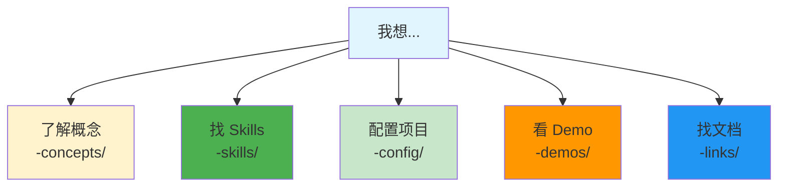
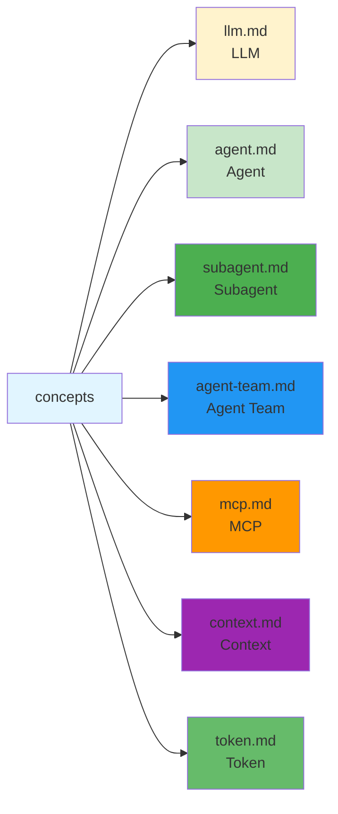
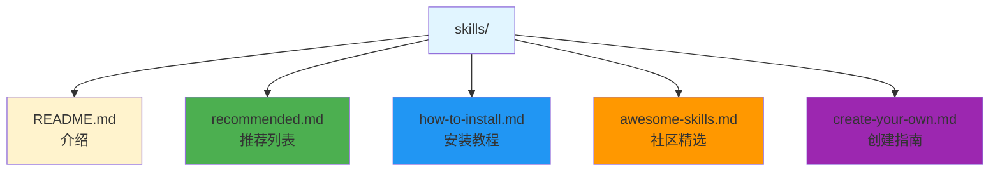
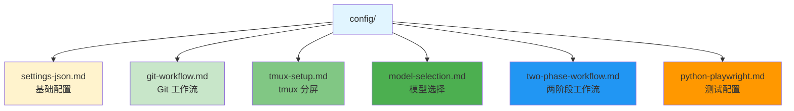
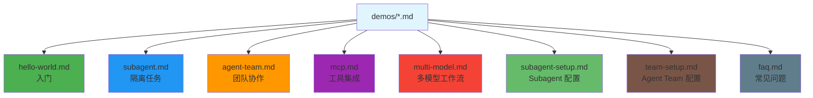
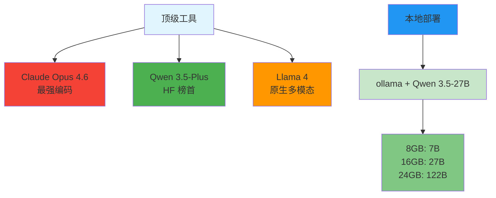

# AI Agent 使用导航

> **定位**: 精简导航 + 实战 Demo，详细内容查阅官方文档
>
> **更新**: 2026年3月

## 🎯 快速开始



## 📚 目录结构

```
agent-doc/
├── concepts/      基础概念介绍
├── skills/        Skills 导航和推荐
├── config/        配置指南
├── demos/         实战示例
└── links/         官方文档链接
```

---

## 📖 基础概念 (concepts/)



## 🔧 Skills 导航 (skills/)



**推荐资源**:
- [skills.sh](https://skills.sh) - Skills 发现平台

## ⚙️ 配置指南 (config/)



## 🎬 实战示例 (demos/)



## 🔗 官方链接 (links/)

- [官方文档](links/official.md)
- [模型平台](links/models.md)
- [工具链接](links/tools.md)

---

## ⚡ 2026 年 3 月快照



---

## 🤝 贡献

发现好用的 Skill 或 Demo？欢迎 PR！

## 📄 许可证

MIT License

---

<div align="center">

**⭐ Star 收藏，方便下次找到**

Made with ❤️ by the AI Agent community

</div>
