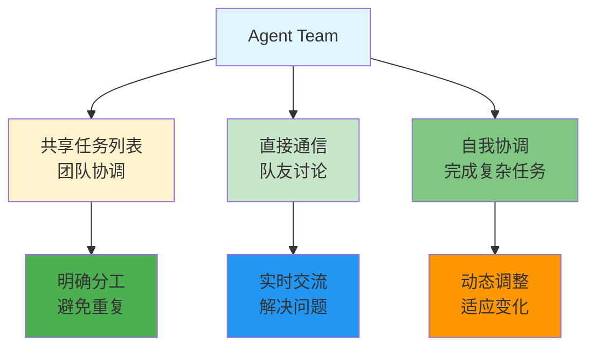
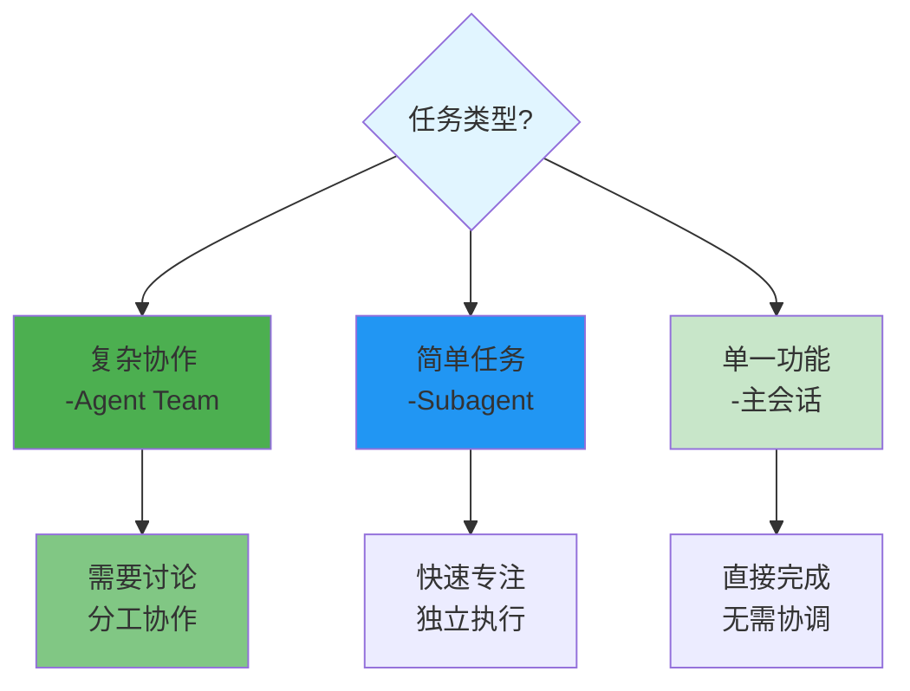
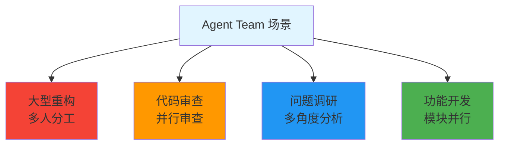

# Agent Team - 代理团队

> 📖 **详细文档**: [Claude Code - Agent Teams](https://code.claude.com/docs/en/agent-teams)

## 什么是 Agent Team？

**Agent Team** - 多个独立 Agent 会话协作完成复杂任务，队友间可以直接通信。

## Subagent vs Agent Team

```mermaid
flowchart TD
    subgraph Subagent_工作流
        A1[主会话] --> A2[Subagent 1<br/>独立上下文]
        A1 --> A3[Subagent 2<br/>独立上下文]
        A2 --> A4[返回摘要<br/>到主会话]
        A3 --> A5[返回摘要<br/>到主会话]
    end

    subgraph Agent_Team_工作流
        B1[队友 1] --> B2[共享任务列表]
        B2 --> B3[队友 2]
        B2 --> B4[队友 3]
        B3 -.->|直接通信| B4
        B4 -.->|直接通信| B3
        B3 -.->|直接通信| B1
        B4 -.->|直接通信| B1
    end

    style A1 fill:#f44336
    style A2 fill:#c8e6c9
    style A3 fill:#c8e6c9
    style B1 fill:#4caf50
    B2 fill:#ff9800
    B3 fill:#2196f3
    B4 fill:#9c27b0
```

## Agent Team 特点



## 何时使用 Agent Team



## 典型场景



## 使用示例

```markdown
# 启动 Agent Team 进行重构
"启动 Agent Team 重构项目：
- 队友 1: 分析现有架构
- 队友 2: 设计新架构
- 队友 3: 逐步迁移
共享任务列表，实时讨论协调"
```

## 相关概念

- [Agent](./agent.md) - 单个 Agent 基础
- [Subagent](./subagent.md) - 隔离任务执行
- [协作模式](./agent.md) - 协作工作方式

## 资源链接

- **Claude Code**: https://code.claude.com/docs/en/agent-teams
- **最佳实践**: [并行工作](https://code.claude.com/docs/en/parallel-work)
