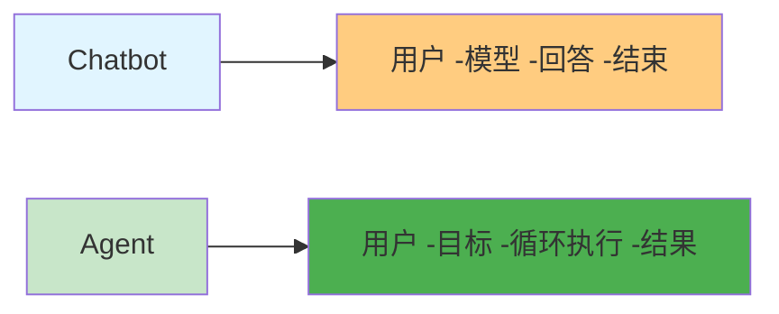
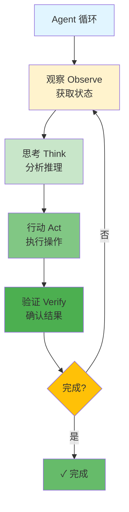

# Agent - AI 代理

> 📖 **详细文档**: [Claude Code - How it works](https://code.claude.com/docs/en/how-claude-code-works)

## 什么是 Agent？

**Agent** - 能自主执行任务以达到目标的 AI 系统，核心是 **循环执行**：观察 -思考 -行动 -验证

## Chatbot vs Agent

## Agent 循环

## 相关概念

- [Subagent](./subagent.md) - 独立上下文的 Agent
- [Agent Team](./agent-team.md) - 多 Agent 协作
- [LLM](./llm.md) - Agent 的基础模型

## 工具对比

| 工具 | 类型 | 特点 |
|------|------|------|
| **Claude Code** | CLI | 最强 Agent 能力 |
| **Cursor** | IDE | 多 Agent 并行 |
| **OpenDevin** | 开源 | 自主软件工程师 |

## 资源链接

- **Claude Code**: https://code.claude.com
- **Agentic Patterns**: https://www.anthropic.com/news/agentic-patterns
