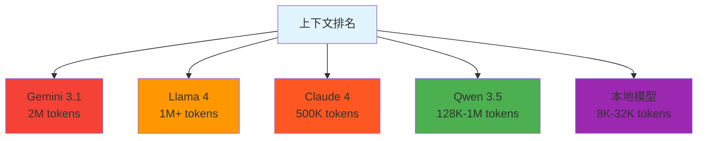
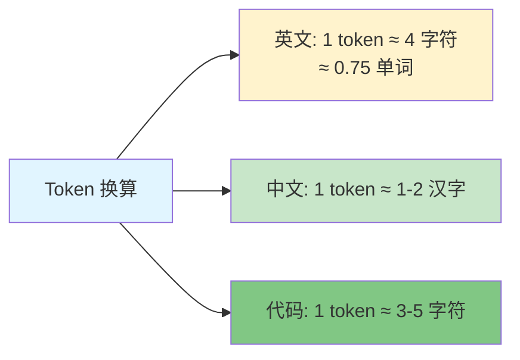

# 上下文窗口 - Context Window

> 📖 **详细文档**: [Claude Code - Context](https://code.claude.com/docs/en/context)

## 什么是上下文窗口？

**上下文窗口** - LLM 一次性能"看到"的最大信息量，以 Token 为单位。

## 为什么重要？

```mermaid
flowchart TD
    A[上下文大小] --> B[太小 -无法理解大项目<br/>容易"忘记"]
    A --> C[太大 -浪费资源<br/>响应变慢]
    A --> D[合适 -高效处理<br/>成本可控]

    style A fill:#e1f5ff
    style B fill:#f44336
    style C fill:#ff9800
    style D fill:#4caf50
```

## 2026 模型上下文长度



## Token 换算



## 管理技巧

```mermaid
flowchart TD
    A[管理策略] --> B[分阶段处理<br/>不要一次处理整个项目]
    A --> C[使用 @ 引用<br/>不复制粘贴大段内容]
    A --> D[使用 Subagent<br/>隔离大文件分析]
    A --> E[/clear 清理<br/>定期清理上下文]

    style A fill:#e1f5ff
    style B fill:#4caf50
    style C fill:#2196f3
    style D fill:#ff9800
    style E fill:#9c27b0
```

## 相关概念

- [Token](./token.md) - Token 详细说明
- [Subagent](./subagent.md) - 隔离大文件
- [Agent](./agent.md) - Agent 如何管理上下文

## 资源链接

- **Claude Code**: https://code.claude.com/docs/en/context
