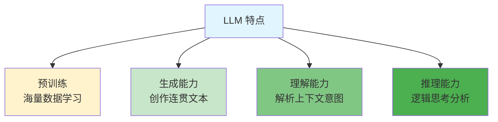
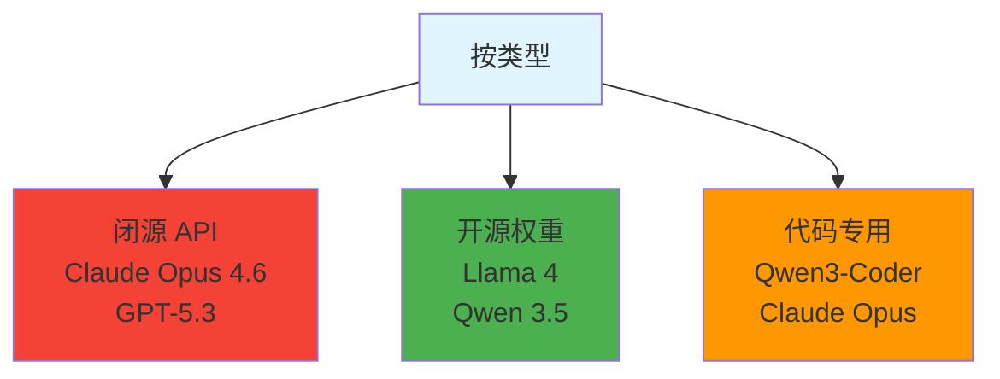

# LLM - 大语言模型

> 📖 **详细文档**: [Claude 官方文档](https://docs.anthropic.com) | [OpenAI 文档](https://platform.openai.com/docs)

## 什么是 LLM？

**LLM (Large Language Model)** - 在海量文本数据上训练的神经网络，能理解和生成人类语言。

## 核心特点

## 2026 主流模型

## 关键参数

| 参数      | 说明        | 示例                  |
|---------|-----------|---------------------|
| **参数量** | 模型规模，影响能力 | 7B, 27B, 122B       |
| **上下文** | 一次处理信息量   | 128K, 1M, 2M tokens |
| **量化**  | 精度压缩      | FP16, INT8, Q4      |

## 相关概念

- [Agent](./agent.md) - LLM 的自主应用
- [Token](./token.md) - LLM 处理单位
- [上下文](./context.md) - 信息处理上限

## 资源链接

- **Hugging Face**: https://huggingface.co/models
- **魔塔社区**: https://modelscope.cn/models
- **Ollama 库**: https://ollama.com/library
