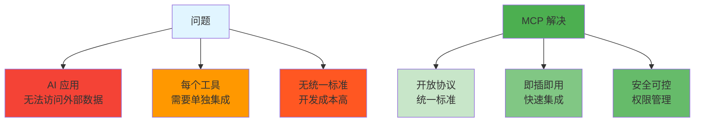
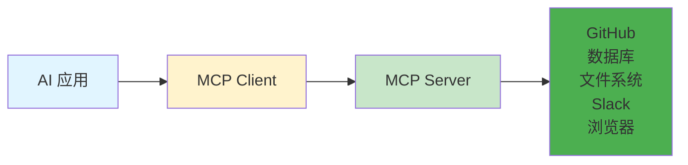

# MCP - Model Context Protocol

> 📖 **详细文档**: [MCP 官方文档](https://modelcontextprotocol.io/)

## 什么是 MCP？

**MCP (Model Context Protocol)** - 连接 AI 应用到外部数据的开放标准协议。

## MCP 解决什么问题？



## MCP 架构



## 常用 MCP 服务器

| 服务器            | 功能         | 获取                                                    |
|----------------|------------|-------------------------------------------------------|
| **GitHub**     | PR 管理、代码操作 | `npm install @modelcontextprotocol/server-github`     |
| **Postgres**   | 数据库查询      | `npm install @modelcontextprotocol/server-postgres`   |
| **Filesystem** | 文件访问       | `npm install @modelcontextprotocol/server-filesystem` |
| **Slack**      | 消息发送       | 社区贡献                                                  |
| **Browser**    | 浏览器控制      | `@modelcontextprotocol/server-puppeteer`              |

## 快速开始

```bash
# 1. 安装服务器
npm install -g @modelcontextprotocol/server-github

# 2. 配置 ~/.claude/settings.json
{
  "mcpServers": {
    "github": {
      "command": "npx",
      "args": ["-y", "@modelcontextprotocol/server-github"]
    }
  }
}

# 3. 验证
claude mcp list
```

## 相关概念

- [Skills](../skills/) - 可复用知识
- [CLAUDE.md](../skills/) - 项目配置

## 资源链接

- **MCP 官网**: https://modelcontextprotocol.io
- **服务器列表**: https://github.com/modelcontextprotocol/servers
- **规范文档**: https://spec.modelcontextprotocol.io/
