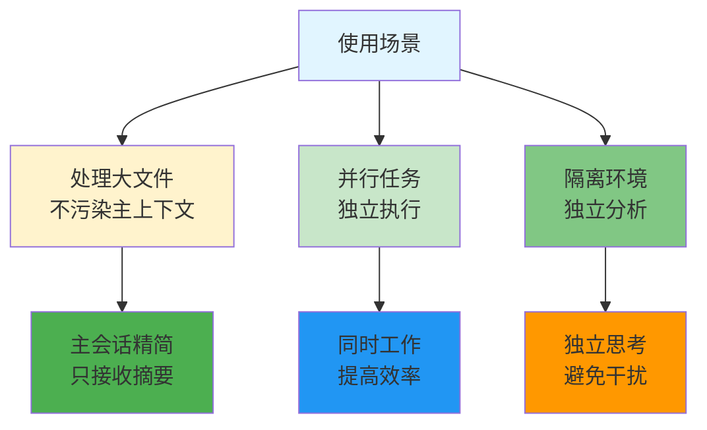
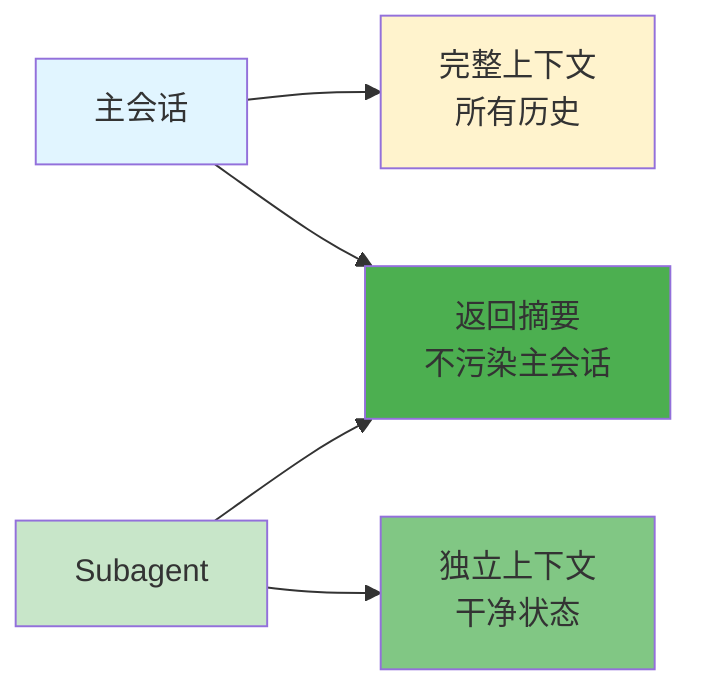
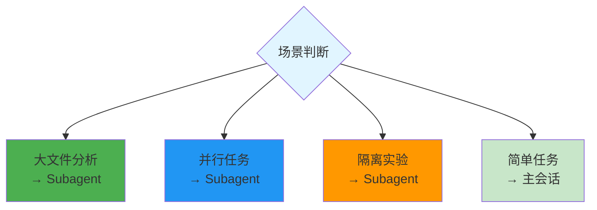

# Subagent - 子代理

> 📖 **详细文档**: [Claude Code - Subagents](https://code.claude.com/docs/en/subagents)

## 什么是 Subagent？

**Subagent** - 在独立上下文中运行的 Agent，用于隔离任务和并行工作。

## 为什么要用 Subagent？



## Subagent vs 主会话



## 何时使用 Subagent



## 使用示例

```markdown
# 使用 Subagent 分析大项目
"用 subagent 分析 src/ 目录结构：
1. 独立分析每个模块
2. 总结架构
3. 报告发现
4. 主会话只接收摘要"
```

## 相关概念

- [Agent](./agent.md) - Agent 基础概念
- [Agent Team](./agent-team.md) - 多 Agent 协作
- [上下文管理](./context.md) - 为什么需要隔离

## 资源链接

- **Claude Code**: https://code.claude.com/docs/en/subagents
- **文档**: [如何使用 Subagents](https://code.claude.com/docs/en/parallel-work)
