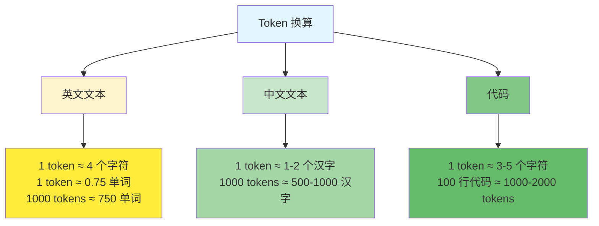
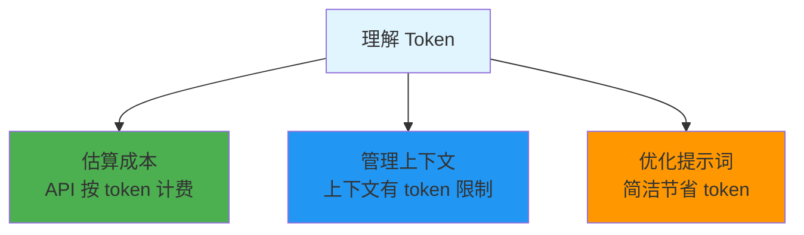
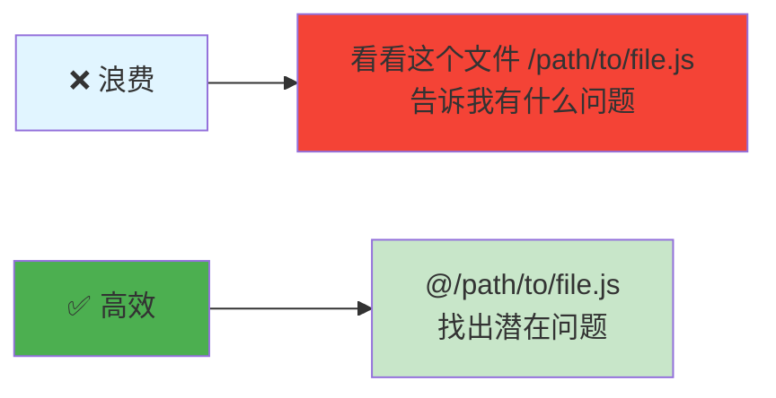

# Token - 基本单位

## 什么是 Token？

**Token** - LLM 处理文本的基本单位，类似单词的片段或字符组合。

## Token 换算

## 为什么理解 Token 很重要？

## 节省 Token 技巧

## 相关概念

- [上下文窗口](./context.md) - Token 限制
- [LLM](./llm.md) - 使用 Token 的模型

## 估算工具

- **Tokenizr**: https://tokenzer.net
- **Claude Token Counter**: 内置显示

## 资料链接

- **OpenAI Tokenizer**: https://platform.openai.com/tokenizer
- **Anthropic Pricing**: https://www.anthropic.com/pricing
