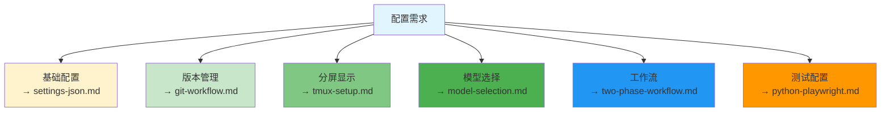

# 配置指南

> 本目录包含 Claude Code 实用配置指南

## 指南列表

| 指南 | 说明 |
|------|------|
| **settings-json.md** | settings.json 完整配置 |
| **git-workflow.md** | Git 工作流配置 |
| **tmux-setup.md** | tmux 分屏配置 |
| **model-selection.md** | 模型选择策略 |
| **two-phase-workflow.md** | 两阶段工作流 |
| **python-playwright.md** | Python + Playwright 配置 |

## 快速索引

