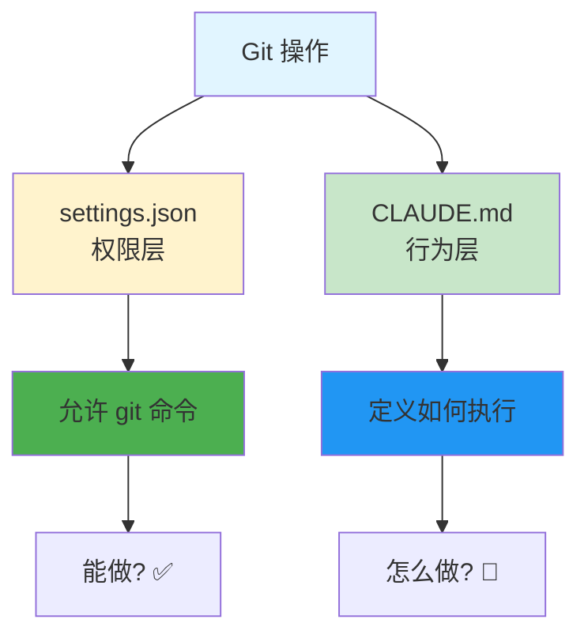

# Git 工作流配置指南

> 让 Claude Code 自动遵循 Git 规范

## 配置步骤

### 1. settings.json - 权限配置

```jsonc
{
  "permissions": {
    "allow": [
      "Read(**)",
      "Bash(git *)"
    ]
  }
}
```

### 2. CLAUDE.md - 行为规范

在项目根目录创建 `CLAUDE.md`：

```markdown
# 项目开发规范

## Git 工作流

### 自动提交
- 每完成一个独立功能、修复或重构后，主动执行 git commit
- commit 前先执行 `git diff` 确认改动范围

### Commit 格式
```
<类型>: <简短描述>
```

**类型**:
- `feat` - 新功能
- `fix` - bug 修复
- `refactor` - 重构
- `docs` - 文档更新
- `chore` - 杂项维护
- `test` - 测试相关

**示例**:
```
feat: 添加用户登录功能
fix: 修复密码验证错误
refactor: 重构认证模块
docs: 更新 API 文档
```

### 推送规范
- 不主动执行 `git push`
- 提交完成后告知，等待确认后再 push
- 不执行 `git reset --hard` 等破坏性操作

## 开发习惯
- 每次修改前说明计划
- 修改后简要总结改动
- 遇到不确定的需求，先询问再动手
```

## 两层控制



| 层级 | 文件 | 控制内容 | 示例 |
|------|------|----------|------|
| **权限层** | settings.json | 能不能执行 | 允许 `Bash(git *)` |
| **行为层** | CLAUDE.md | 怎么执行 | commit 格式、何时 push |

## 完整示例

### settings.json

```jsonc
{
  "$schema": "https://json.schemastore.org/claude-code-settings.json",
  "permissions": {
    "allow": [
      "Read(**)",
      "Edit(**)",
      "Bash(git status)",
      "Bash(git diff *)",
      "Bash(git log *)",
      "Bash(git add *)",
      "Bash(git commit *)",
      "Bash(git branch *)",
      "Bash(git checkout *)",
      "Bash(git merge *)",
      "Bash(git pull *)",
      "Bash(git push *)"
    ]
  }
}
```

### CLAUDE.md

```markdown
# 项目规范

## Git 工作流

### 提交流程
1. 完成功能/修复
2. 运行 `git diff` 确认改动
3. 执行 `git commit`
4. 等待人工确认后再 `git push`

### Commit 规范
- 格式：`<类型>(<范围>): <描述>`
- 类型：feat / fix / refactor / docs / chore / test
- 范围：backend / frontend / tests / docs / deploy

### 示例
```
feat(backend): 添加用户认证 API
fix(frontend): 修复登录表单验证
test(auth): 添加登录测试用例
docs(api): 更新 API 文档
```

### 安全规则
- 不执行 `git reset --hard`
- 不执行 `git push --force`
- 敏感操作前先询问

## 项目信息
- 语言：Python 3.11
- 框架：FastAPI
- 测试：pytest
```

## 多角色 Commit

使用 Subagent/Agent Team 时，不同角色用不同 commit 格式：

```markdown
## Git 规范

### 每个 Agent 独立 Commit
- @agent-backend: `feat(backend): <描述>`
- @agent-frontend: `feat(frontend): <描述>`
- @agent-tester: `test: <描述>`
- @agent-devops: `chore(devops): <描述>`

### 提交流程
1. 每个 agent 完成后自动 commit
2. 全部完成后统一确认 push
3. Lead agent 负责最终审查
```

## 与 GitHub 集成

### .github/workflows/claude.yml

```yaml
name: Claude Code Assistant
on:
  issue_comment:
    types: [created]
  pull_request:
    types: [opened, synchronize]

jobs:
  claude:
    runs-on: ubuntu-latest
    permissions:
      contents: write
      pull-requests: write
    steps:
      - uses: actions/checkout@v4
      - uses: anthropics/claude-code-action@v1
        with:
          anthropic_api_key: ${{ secrets.ANTHROPIC_API_KEY }}
          model: claude-sonnet-4-6
```

## 常见问题

**Q: Commit 中文还是英文？**

A: 按团队约定，中文或英文都可以，保持一致即可。

**Q: 如何让 Claude 自动 push？**

A: 不推荐自动 push。如果需要，在 CLAUDE.md 中添加"完成后自动 push"。

**Q: 如何防止误操作？**

A: 在 permissions 中只允许安全的 git 命令，排除 `reset --hard`、`push --force` 等。

## 相关指南

- [settings.json 配置](./settings-json.md)
- [两阶段工作流](./two-phase-workflow.md)
