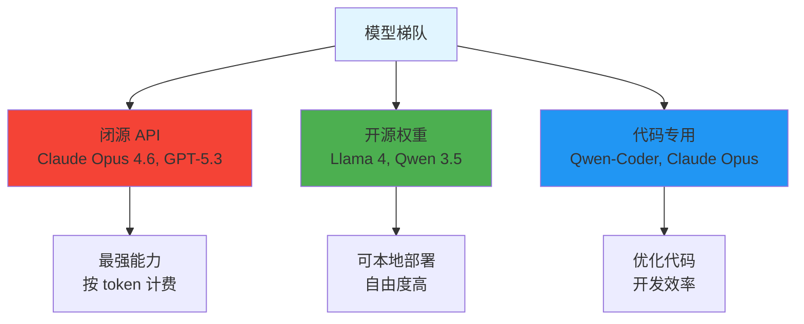
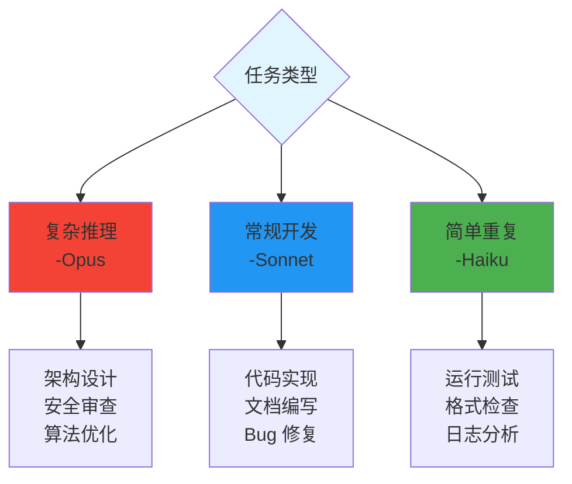
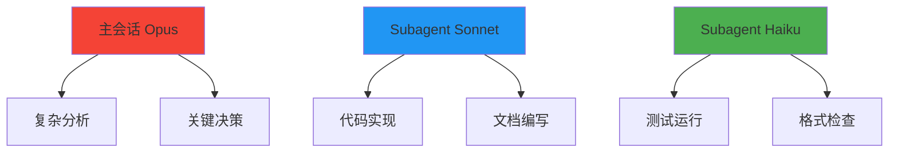
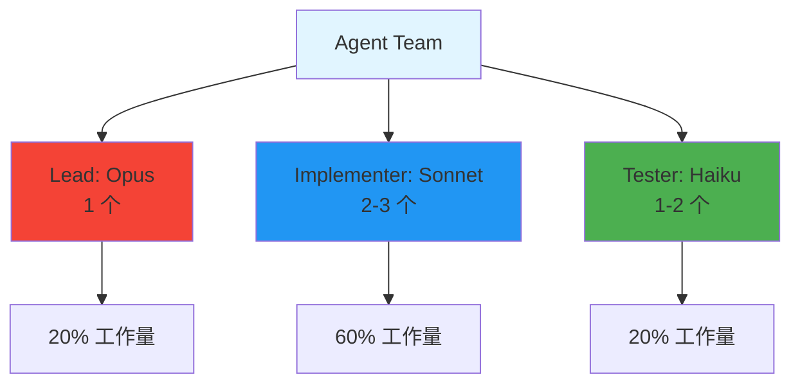
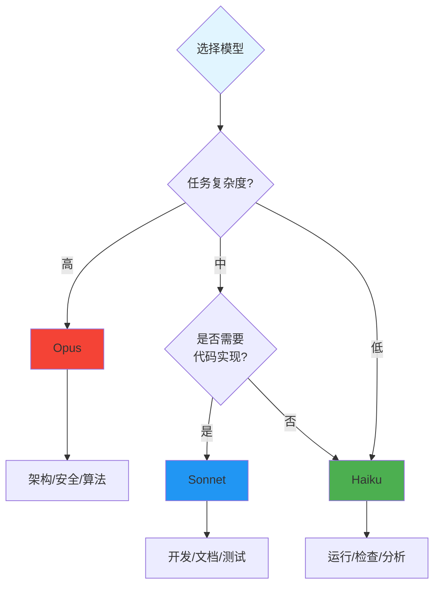
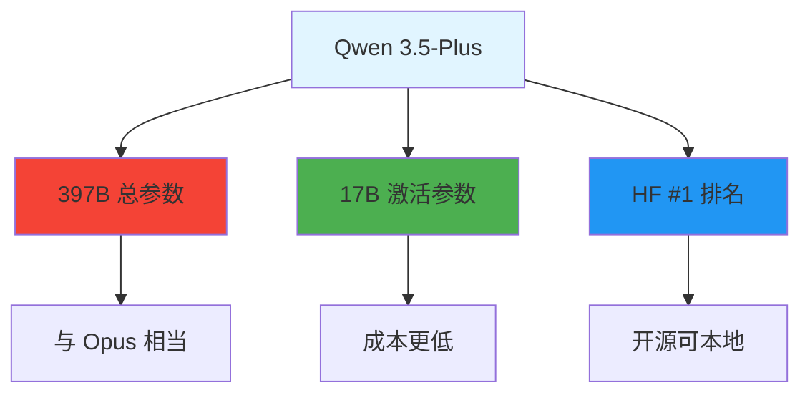

# 模型选择策略

> 为不同任务选择合适的模型，平衡质量和成本

## 2026 主流模型



## Claude 模型对比

| 模型 | 位置 | 能力 | 成本 | 适用场景 |
|------|------|------|------|----------|
| **Opus 4.6** | 最强 | 复杂推理、深度分析 | 最高 | 架构设计、复杂问题 |
| **Sonnet 4.6** | 平衡 | 日常开发 | 中等 | 代码实现、文档编写 |
| **Haiku 4.5** | 快速 | 简单任务 | 最低 | 测试运行、格式检查 |

## 选择策略

### 按任务类型



### 按角色分配

| 角色 | 模型 | 原因 |
|------|------|------|
| **架构师** | Opus | 需要全局视野和复杂决策 |
| **前端/后端** | Sonnet | 实现任务，平衡质量和成本 |
| **测试/运维** | Haiku | 重复性高，速度优先 |

## 配置方式

### 全局默认模型

```jsonc
// settings.json
{
  "subagentModel": "claude-sonnet-4-6"
}
```

### Agent 级别指定

```markdown
---
name: architect
model: claude-opus-4-6
---
```

```markdown
---
name: tester
model: claude-haiku-4-5
---
```

## 成本优化策略

### 主会话 + Subagent 组合



**成本对比**:
| 配置 | 相对成本 |
|------|----------|
| 全程 Opus | 100% |
| 主 Opus + Subagent Sonnet | ~40% |
| 主 Opus + Subagent Haiku | ~15% |

### Agent Team 成本控制



**注意**: Agent Team 消耗约 15 倍 token，需合理使用

## 实际配置示例

### 配置 1: 质量优先

```jsonc
{
  "subagentModel": "claude-opus-4-6"
}
```

适用：关键项目、复杂系统

### 配置 2: 成本平衡（推荐）

```jsonc
{
  "subagentModel": "claude-sonnet-4-6"
}
```

Agent 覆盖：
```markdown
---
# agents/architect.md
model: claude-opus-4-6
---
```

适用：日常开发

### 配置 3: 成本优先

```jsonc
{
  "subagentModel": "claude-haiku-4-5"
}
```

适用：简单任务、批量处理

### 配置 4: 两阶段工作流

```jsonc
{
  "subagentModel": "claude-sonnet-4-6"
}
```

```markdown
---
# agents/architect.md - 设计阶段
model: claude-opus-4-6
---
```

```markdown
---
# agents/backend.md - 实现阶段
model: claude-sonnet-4-6
---
```

```markdown
---
# agents/tester.md - 测试阶段
model: claude-haiku-4-5
---
```

## 选择决策树



## 常见场景

| 场景 | 主会话 | Subagent | Agent Team |
|------|--------|----------|------------|
| **新功能开发** | Opus | Sonnet | Lead: Opus, 其他: Sonnet |
| **Bug 修复** | Sonnet | Haiku | 不推荐 |
| **代码审查** | Opus | - | 不推荐 |
| **文档编写** | Sonnet | Haiku | 不推荐 |
| **测试运行** | - | Haiku | 不推荐 |
| **架构设计** | Opus | - | 不推荐 |
| **大型重构** | Opus | Sonnet | Lead: Opus, 其他: Sonnet |

## 开源模型替代

### Qwen 3.5 (MoE)



### 本地部署方案

| 内存 | 推荐 |
|------|------|
| 8GB | Qwen 3.5-7B |
| 16GB | Qwen 3.5-27B |
| 24GB+ | Qwen 3.5-122B |

## 相关指南

- [settings.json 配置](./settings-json.md)
- [两阶段工作流](./two-phase-workflow.md)
- [Subagent 配置](../demos/06-subagent-config/)
