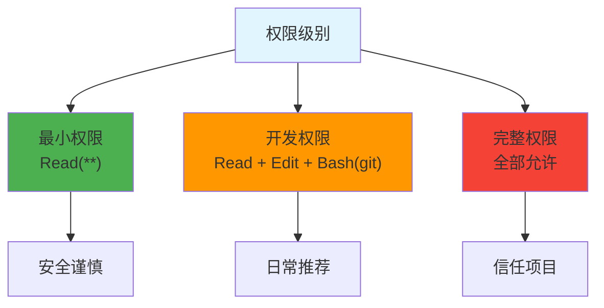

# settings.json 完整配置指南

> 📖 **相关文档**: [Claude Code Configuration](https://code.claude.com/docs/en/configuration)

## 基础模板

```jsonc
{
  "$schema": "https://json.schemastore.org/claude-code-settings.json",
  "subagentModel": "claude-sonnet-4-6",
  "teammateMode": "auto",
  "env": {},
  "permissions": {
    "allow": []
  }
}
```

## 常见错误

### ❌ 错误：缺少逗号

```jsonc
{
  "$schema": "https://json.schemastore.org/claude-code-settings.json"  // ❌ 缺少逗号
  "env": {}
}
```

### ✅ 正确：添加逗号

```jsonc
{
  "$schema": "https://json.schemastore.org/claude-code-settings.json",  // ✅
  "env": {}
}
```

## 配置字段说明

### $schema

JSON Schema 验证地址，必须放在第一行：

```jsonc
"$schema": "https://json.schemastore.org/claude-code-settings.json"
```

### subagentModel

Subagent 默认模型：

```jsonc
"subagentModel": "claude-sonnet-4-6"
```

| 模型 | 适用场景 |
|------|----------|
| `claude-opus-4-6` | 复杂推理、架构设计 |
| `claude-sonnet-4-6` | 日常开发（默认） |
| `claude-haiku-4-5` | 简单重复任务 |

### teammateMode

Agent 显示模式：

```jsonc
"teammateMode": "auto"  // auto | tmux | in-process
```

| 模式 | 说明 |
|------|------|
| `auto` | tmux 内自动分 pane，否则 in-process |
| `tmux` | 强制使用 tmux split pane |
| `in-process` | 所有 agent 在同一终端 |

### env - 环境变量

#### Python 版本配置

**使用 pyenv**:
```jsonc
{
  "env": {
    "PATH": "/Users/your_name/.pyenv/shims:${PATH}",
    "PYENV_VERSION": "3.11.6"
  }
}
```

**使用 virtualenv**:
```jsonc
{
  "env": {
    "PATH": "/Users/your_name/.virtualenvs/mundo/bin:${PATH}",
    "VIRTUAL_ENV": "/Users/your_name/.virtualenvs/mundo",
    "PYTHONPATH": "${VIRTUAL_ENV}/lib/python3.11/site-packages"
  }
}
```

**使用 conda**:
```jsonc
{
  "env": {
    "PATH": "/Users/your_name/miniconda3/envs/myenv/bin:${PATH}",
    "CONDA_DEFAULT_ENV": "myenv",
    "CONDA_PREFIX": "/Users/your_name/miniconda3/envs/myenv"
  }
}
```

#### Node 版本配置

**使用 nvm**:
```jsonc
{
  "env": {
    "PATH": "/Users/your_name/.nvm/versions/node/v20.11.0/bin:${PATH}",
    "NODE_VERSION": "20.11.0"
  }
}
```

**使用系统 node**:
```jsonc
{
  "env": {
    "PATH": "/usr/local/opt/node@20/bin:${PATH}",
    "NODE_PATH": "/usr/local/opt/node@20/lib/node_modules"
  }
}
```

#### Playwright 路径

```jsonc
{
  "env": {
    "PLAYWRIGHT_BROWSERS_PATH": "/Users/your_name/.cache/ms-playwright"
  }
}
```

### permissions - 权限配置

```jsonc
{
  "permissions": {
    "allow": [
      "Read(**)",      // 读取所有文件
      "Edit(**)",      // 编辑所有文件
      "Bash(git *)",   // Git 命令
      "Bash(python *)",// Python 命令
      "Bash(pytest *)",// pytest 命令
      "Bash(playwright *)",// Playwright 命令
      "Bash(pip *)",   // pip 命令
      "Bash(npm *)"    // npm 命令
    ]
  }
}
```

#### 权限模式



#### 逐条权限（更安全）

```jsonc
{
  "permissions": {
    "allow": [
      "Read(**)",
      "Bash(git status)",
      "Bash(git diff *)",
      "Bash(git add *)",
      "Bash(git commit *)",
      "Bash(python *)"
    ]
  }
}
```

## 完整示例

### Python 项目

```jsonc
{
  "$schema": "https://json.schemastore.org/claude-code-settings.json",
  "subagentModel": "claude-sonnet-4-6",
  "teammateMode": "auto",
  "env": {
    "PATH": "/Users/your_name/.virtualenvs/mundo/bin:${PATH}",
    "VIRTUAL_ENV": "/Users/your_name/.virtualenvs/mundo",
    "PYTHONPATH": "${VIRTUAL_ENV}/lib/python3.11/site-packages"
  },
  "permissions": {
    "allow": [
      "Read(**)",
      "Edit(**)",
      "Bash(git *)",
      "Bash(python *)",
      "Bash(pytest *)",
      "Bash(pip *)"
    ]
  }
}
```

### 全栈项目

```jsonc
{
  "$schema": "https://json.schemastore.org/claude-code-settings.json",
  "subagentModel": "claude-sonnet-4-6",
  "teammateMode": "tmux",
  "env": {
    "PATH": "/Users/your_name/.virtualenvs/mundo/bin:/Users/your_name/.nvm/versions/node/v20/bin:${PATH}",
    "VIRTUAL_ENV": "/Users/your_name/.virtualenvs/mundo",
    "NODE_VERSION": "20"
  },
  "permissions": {
    "allow": [
      "Read(**)",
      "Edit(**)",
      "Bash(git *)",
      "Bash(python *)",
      "Bash(pytest *)",
      "Bash(npm *)",
      "Bash(node *)"
    ]
  }
}
```

### 开启 Agent Teams

```jsonc
{
  "$schema": "https://json.schemastore.org/claude-code-settings.json",
  "env": {
    "CLAUDE_CODE_EXPERIMENTAL_AGENT_TEAMS": "1"
  },
  "teammateMode": "tmux",
  "permissions": {
    "allow": ["Read(**)", "Edit(**)", "Bash(git *)"]
  }
}
```

## 验证配置

```bash
# 检查 JSON 语法
cat .claude/settings.json | jq .

# 验证生效
claude --help
```

## 相关指南

- [Git 工作流配置](./git-workflow.md)
- [tmux 分屏配置](./tmux-setup.md)
- [模型选择策略](./model-selection.md)
