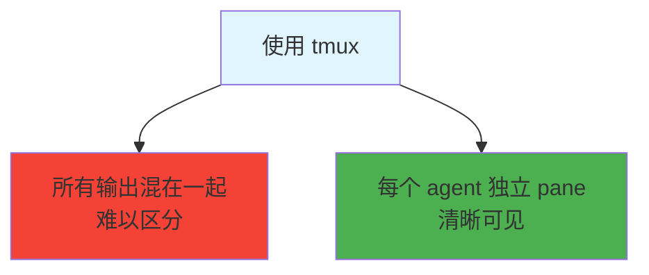

# tmux 分屏配置指南

> 使用 tmux 查看 Subagent/Agent Team 工作状态

## 为什么使用 tmux？



## 配置方式

### 方式 1: settings.json 配置（推荐）

```jsonc
{
  "teammateMode": "tmux"
}
```

### 方式 2: 在 tmux 会话中启动

```bash
# 创建 tmux 会话
tmux new-session -s claude

# 启动 Claude Code
claude

# Subagent 自动分到不同 pane
```

## 三种模式对比

| 模式             | 设置                             | 效果                   |
|----------------|--------------------------------|----------------------|
| **auto**       | `"teammateMode": "auto"`       | tmux 内自动分 pane，否则同终端 |
| **tmux**       | `"teammateMode": "tmux"`       | 强制使用 tmux split pane |
| **in-process** | `"teammateMode": "in-process"` | 所有 agent 在同一终端       |

## tmux 基础操作

### 安装 tmux

```bash
# macOS
brew install tmux

# Linux (Ubuntu/Debian)
sudo apt install tmux

# Linux (CentOS/RHEL)
sudo yum install tmux
```

### 会话管理

| 命令                          | 功能             |
|-----------------------------|----------------|
| `tmux new-session -s name`  | 创建新会话          |
| `tmux attach -t name`       | 连接会话           |
| `tmux detach`               | 分离会话（Ctrl+b d） |
| `tmux list-sessions`        | 列出会话           |
| `tmux kill-session -t name` | 删除会话           |

### 窗口操作

| 快捷键          | 功能      |
|--------------|---------|
| `Ctrl+b c`   | 创建新窗口   |
| `Ctrl+b n`   | 下一个窗口   |
| `Ctrl+b p`   | 上一个窗口   |
| `Ctrl+b 0-9` | 切换到指定窗口 |
| `Ctrl+b ,`   | 重命名窗口   |

### Pane 操作

| 快捷键          | 功能               |
|--------------|------------------|
| `Ctrl+b "`   | 水平分割（上下）         |
| `Ctrl+b %`   | 垂直分割（左右）         |
| `Ctrl+b 方向键` | 切换 pane          |
| `Ctrl+b o`   | 依次切换 pane        |
| `Ctrl+b z`   | 放大/恢复 pane       |
| `Ctrl+b x`   | 关闭 pane          |
| `Ctrl+b q`   | 显示 pane 编号，按数字切换 |

### 滚动模式

| 快捷键                     | 功能     |
|-------------------------|--------|
| `Ctrl+b [`              | 进入滚动模式 |
| 方向键 / `PageUp/PageDown` | 滚动     |
| `q`                     | 退出滚动模式 |
| `/`                     | 搜索（向后） |
| `?`                     | 搜索（向前） |

## Agent Team 布局示例

### 四分屏布局

```
┌─────────────────────────────────────────┐
│  @teammate-lead (队长)                   │
├──────────┬──────────┬──────────┬────────┤
│ frontend │ backend  │ tester   │ devops │
└──────────┴──────────┴──────────┴────────┘
```

启动命令：

```bash
# 创建会话并分割
tmux new-session -s claude \; split-window -h \; split-window \; split-window -h
```

### 主从布局

```
┌─────────────────────────────────────────┐
│           @teammate-lead                 │
├─────────────────────────────────────────┤
│  frontend  │  backend  │  tester/devops  │
└───────────┴───────────┴─────────────────┘
```

## 实用配置

### ~/.tmux.conf

```bash
# 设置默认终端颜色
set -g default-terminal "screen-256color"

# 设置 pane 编号从 1 开始（更符合键盘位置）
set -g base-index 1
setw -g pane-base-index 1

# 使用鼠标切换 pane
setw -g mouse on

# 设置快捷键前缀为 Ctrl+a（可选）
# unbind C-b
# set -g prefix C-a

# 状态栏配置
set -g status-bg black
set -g status-fg white
set -g status-left "#S: "
set -g status-right "%H:%M %d-%b-%y"

# 自动重命名窗口
setw -g automatic-rename on

# 更新状态栏间隔
set -g status-interval 1
```

## Claude Code 专用布局脚本

### ~/bin/claude-team.sh

```bash
#!/bin/bash
# Claude Code Agent Team 启动脚本

SESSION="claude-team"

# 检查会话是否存在
if tmux has-session -t $SESSION 2>/dev/null; then
    echo "会话 $SESSION 已存在，正在连接..."
    tmux attach -t $SESSION
    exit 0
fi

# 创建新会话并分割窗口
tmux new-session -d -s $SESSION -n "claude-code"

# 水平分割
tmux split-window -v -t $SESSION:0

# 上半部分垂直分割
tmux split-window -h -t $SESSION:0.0

# 下半部分垂直分割
tmux split-window -h -t $SESSION:0.1

# 重命名窗口
tmux select-window -t $SESSION:0
tmux rename-window -t $SESSION:0 "team"

# 进入会话
tmux attach -t $SESSION
```

使用：

```bash
chmod +x ~/bin/claude-team.sh
~/bin/claude-team.sh
```

## 常见问题

**Q: tmux 中复制粘贴怎么办？**

A: 使用滚动模式（Ctrl+b [），选中后按 Enter 复制，粘贴用 Ctrl+b ]

**Q: 如何调整 pane 大小？**

A: `Ctrl+b :` 进入命令模式，输入 `resize-pane -D 10`（向下调整 10 行）

**Q: 如何保存 tmux 布局？**

A: 使用 tmux-resurrect 插件或手动编写脚本

**Q: Subagent 没有分到独立 pane？**

A: 检查 settings.json 中 `teammateMode` 是否设置为 `"tmux"`

## 相关指南

- [settings.json 配置](./settings-json.md)
- [Agent Team 配置](../demos/07-agent-team-config/)
