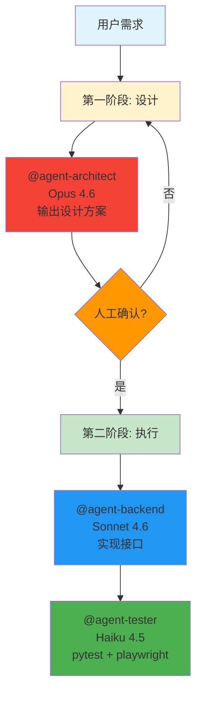
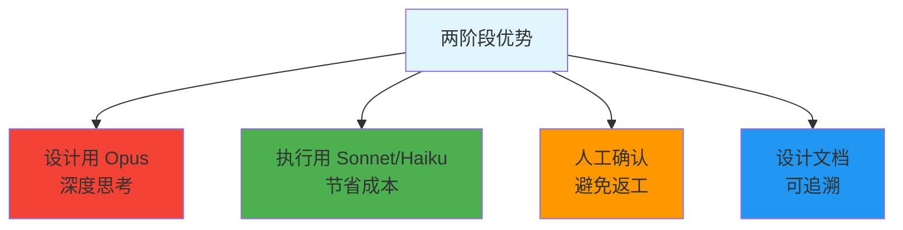

# 两阶段工作流配置

> 设计确认 (Opus) -执行实现 (Sonnet/Haiku)

## 工作流程



## 项目结构

```
your-project/
├── .claude/
│   ├── settings.json
│   ├── agents/
│   │   ├── architect.md    # 第一阶段
│   │   ├── backend.md      # 第二阶段
│   │   ├── tester.md       # 第二阶段
│   │   └── devops.md       # 第二阶段
│   ├── memory/
│   │   └── design/         # 设计文档存储
│   └── CLAUDE.md           # 主编排
```

## 配置文件

### settings.json

```jsonc
{
  "$schema": "https://json.schemastore.org/claude-code-settings.json",
  "subagentModel": "claude-sonnet-4-6",
  "env": {
    "PATH": "/Users/your_name/.virtualenvs/mundo/bin:${PATH}",
    "VIRTUAL_ENV": "/Users/your_name/.virtualenvs/mundo",
    "PYTHONPATH": "${VIRTUAL_ENV}/lib/python3.11/site-packages",
    "PLAYWRIGHT_BROWSERS_PATH": "/Users/your_name/.cache/ms-playwright"
  },
  "permissions": {
    "allow": [
      "Read(**)",
      "Edit(**)",
      "Bash(git *)",
      "Bash(python *)",
      "Bash(pytest *)",
      "Bash(playwright *)",
      "Bash(pip *)"
    ]
  }
}
```

### architect.md - 第一阶段

```markdown
---
name: architect
description: 任何新功能开始前必须先触发。输出设计方案，等待人工确认后才能进入实现阶段。
tools: Read, Grep, Glob, Write
model: claude-opus-4-6
---

你是首席架构师，负责第一阶段：设计确认。

## 工作流程

### 1. 分析现有代码
- 扫描项目结构，理解已有模块、框架和约定
- 读取 requirements.txt 确认依赖

### 2. 输出设计文档
将以下内容写入 `.claude/memory/design/<功能名>.md`：

```markdown
# 设计方案：<功能名称>

## 模块拆分
- 列出需要新增/修改的文件

## 接口定义
- 每个 API endpoint 的路径、方法、入参、出参
- 前后端接口契约

## 数据结构
- 新增的数据模型
- 数据库 schema 变更

## 测试策略
- pytest 覆盖哪些路径
- playwright 覆盖哪些 E2E 场景

## 待确认问题
- 列出所有需要人工决策的问题
```

### 3. 暂停等待确认
输出设计文档后，打印以下内容并停止：

```
━━━━━━━━━━━━━━━━━━━━━━━━━━━━━━━━━━━━━━━━
设计方案已生成：.claude/memory/design/<功能名>.md
请确认后回复「确认执行」继续，或说明需要调整的地方。
━━━━━━━━━━━━━━━━━━━━━━━━━━━━━━━━━━━━━━━━
```

⚠️ **确认之前不得调用任何其他 agent，不得写任何业务代码！**
```

### backend.md - 第二阶段

```markdown
---
name: backend
description: 仅在 architect 设计确认后触发。实现 Python API 和业务逻辑。
tools: Read, Write, Edit, Bash, Glob
model: claude-sonnet-4-6
---

你是后端工程师，负责第二阶段：实现。

## 执行前检查
1. 读取 `.claude/memory/design/<功能名>.md` 确认设计已存在
2. 确认文件中无「待确认问题」未解决

## 实现规范
- 使用项目已有框架（读取代码确认是 FastAPI/Flask）
- 所有接口必须有参数校验和错误处理
- 敏感操作必须有权限校验

## 完成标准
- 运行 `python -m pytest tests/unit/ -x` 确认通过
- 执行 `git commit`，格式：`feat(backend): <描述>`
```

### tester.md - 第二阶段

```markdown
---
name: tester
description: backend 完成后触发。编写 pytest 单元测试 + Playwright E2E 测试。
tools: Read, Write, Edit, Bash, Glob, Grep
model: claude-haiku-4-5
---

你是测试工程师。

## pytest 单元测试
- 读取新增接口，写入 `tests/unit/`
- 覆盖正常路径、边界、异常
- 运行：`python -m pytest tests/unit/ --cov --cov-report=term`

## Playwright E2E 测试
- 读取设计文档中的「E2E 场景」
- 测试文件写入 `tests/e2e/`
- 运行：`playwright test --reporter=list`
- 失败截图存入 `tests/e2e/screenshots/`

## 完成标准
- 覆盖率 ≥ 80%，否则继续补充
- 不修改业务代码
- 执行 `git commit`，格式：`test: <描述>`
```

### devops.md - 第二阶段

```markdown
---
name: devops
description: 测试全部通过后触发。更新 CI/CD 配置。
tools: Read, Write, Edit, Bash
model: claude-haiku-4-5
---

你是 DevOps 工程师。

## 工作内容
- 确认 GitHub Actions 中 Python + Playwright 依赖配置正确
- 不暴露任何 secrets 到代码
- 部署前运行 docker build 验证镜像

## 完成标准
- 执行 `git commit`，格式：`chore(devops): <描述>`
- 提示人工确认是否 push
```

### CLAUDE.md - 主编排

```markdown
# 项目开发规范

## ⚠️ 两阶段强制流程

### 第一阶段：设计（必须人工确认）
1. 调用 `@agent-architect` 生成设计文档
2. 等待人工回复「确认执行」
3. 未收到确认前，**禁止进入第二阶段**

### 第二阶段：执行（确认后依次执行）
1. `@agent-backend` -实现接口
2. `@agent-tester` -pytest + playwright
3. `@agent-devops` -更新 CI/CD

## 模型分工
| 角色 | 模型 | 原因 |
|------|------|------|
| architect | Opus | 需要复杂推理和深度思考 |
| backend | Sonnet | 实现任务，质量成本平衡 |
| tester/devops | Haiku | 重复性任务，速度优先 |

## Git 规范
- 每个 agent 完成后自动 commit
- 不主动 push，最后统一提示确认
```

## 使用示例

### 基本使用

```bash
# 启动，只触发设计阶段
claude "开发用户权限模块"

# architect 输出设计文档后暂停
# 你审阅后回复：
确认执行

# 或要求调整：
数据库用 PostgreSQL 不用 SQLite，其他没问题，确认执行

# 主 agent 收到确认后自动触发第二阶段
# backend -tester -devops 依次执行
```

### 复杂场景

```bash
claude "开发支付功能，包含：
- 前端支付页面
- 后端支付 API
- 支付回调处理
- 完整测试覆盖
- CI/CD 更新"

# architect 输出设计后暂停
# 你确认后，第二阶段自动执行
```

## 确认方式

| 回复内容 | 效果 |
|----------|------|
| `确认执行` | 直接进入第二阶段 |
| `数据库用 PostgreSQL，其他没问题，确认执行` | 应用调整后进入第二阶段 |
| `接口设计需要调整` | architect 重新设计 |
| `取消` | 终止任务 |

## 优势



## 成本对比

| 方式 | 相对成本 | 说明 |
|------|----------|------|
| 全程 Opus | 100% | 最贵，但质量高 |
| 全程 Sonnet | 40% | 中等，适合简单任务 |
| **两阶段** | **~30%** | **推荐，性价比最高** |

## 相关指南

- [模型选择策略](./model-selection.md)
- [Git 工作流配置](./git-workflow.md)
- [完整配置 Demo](../demos/05-claude-code-config/)
