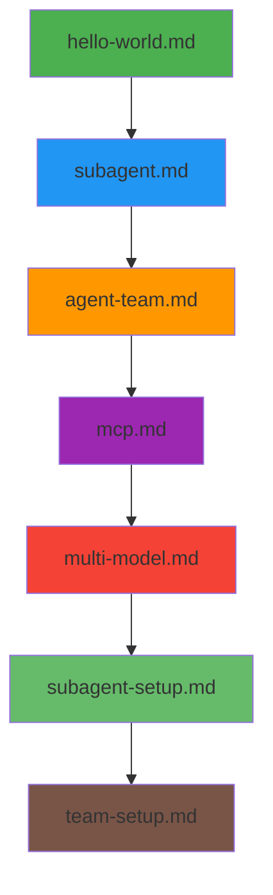

# 实战示例

> 本目录包含可直接运行的实战示例

## 示例列表

| 文件                    | 说明            | 难度   |
|-----------------------|---------------|------|
| **hello-world.md**    | 基础 Agent 使用   | ⭐    |
| **subagent.md**       | Subagent 隔离任务 | ⭐⭐   |
| **agent-team.md**     | Agent Team 协作 | ⭐⭐⭐  |
| **mcp.md**            | MCP 工具集成      | ⭐⭐   |
| **multi-model.md**    | 多模型工作流        | ⭐⭐⭐⭐ |
| **subagent-setup.md** | Subagent 配置   | ⭐⭐⭐  |
| **team-setup.md**     | Agent Team 配置 | ⭐⭐⭐⭐ |
| **faq.md**            | 常见问题          | ⭐⭐   |

## 快速开始

```bash
# 阅读某个示例
cat demos/hello-world.md

# 或在 README 中直接查看
```

## 学习路径



## 贡献示例

欢迎提交你的实战示例！
