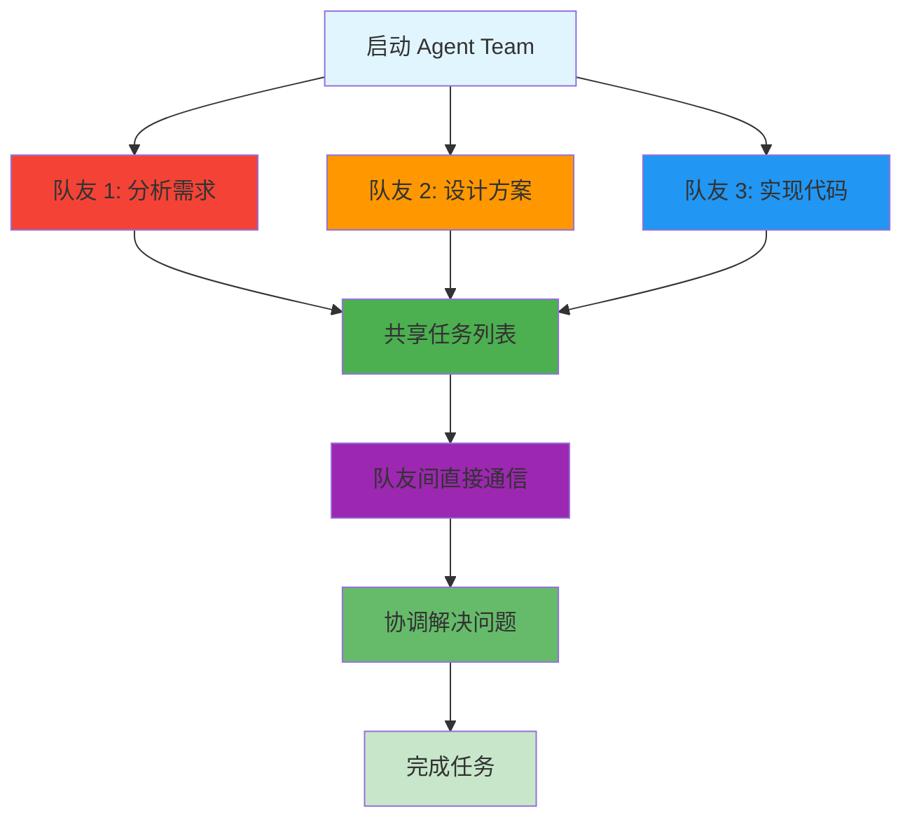
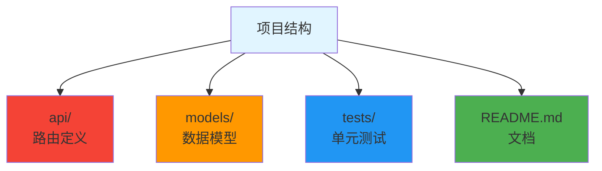
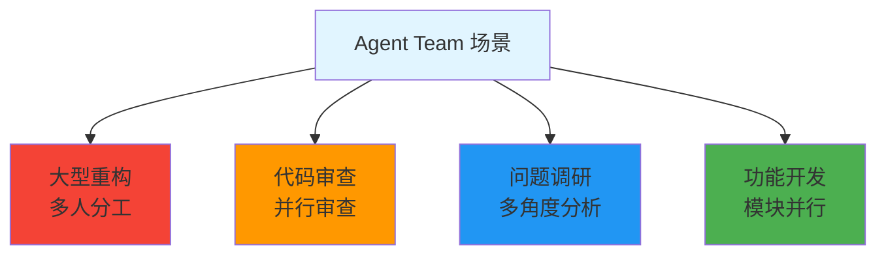

# Agent Team Demo - 多代理协作

> 📖 **相关文档**: [Agent Teams](https://code.claude.com/docs/en/agent-teams)
>
> 📅 **更新日期**: 2026年3月

## 场景

复杂任务需要多个 Agent 协作完成，队友间可以直接通信，共享任务列表。

## 工作流程



## 步骤

### 1. 准备协作任务

```bash
mkdir agent-team-demo
cd agent-team-demo
```

### 2. 启动 Agent Team

```bash
claude

# 在 Claude 中输入:
"启动 Agent Team 完成以下任务:

任务: 创建一个待办事项 API
- RESTful API 设计
- 数据模型定义
- 基本 CRUD 实现

团队分工:
- 队友 1: 分析需求，设计 API 接口
- 队友 2: 设计数据模型和数据库 schema
- 队友 3: 实现代码和测试

共享任务列表，实时讨论协调"
```

### 3. 观察协作过程

Agent Team 会：

- 自动创建共享任务列表
- 队友间分工执行
- 遇到问题直接通信讨论
- 协调解决依赖问题

## 预期结果



## Subagent vs Agent Team

| 特性      | Subagent | Agent Team |
|---------|----------|------------|
| **上下文** | 独立隔离     | 共享任务列表     |
| **通信**  | 只返回摘要    | 队友间直接通信    |
| **协调**  | 主会话控制    | 自我协调       |
| **适用**  | 大文件分析    | 复杂协作任务     |

## 学习要点

- Agent Team 适合需要协作的复杂任务
- 队友间可以直接通信，更高效
- 共享任务列表自动协调分工

## 典型场景



## 下一步

尝试 [MCP Integration Demo](mcp/)
