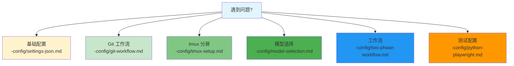

# 常见问题 FAQ

> 💡 **提示**: 详细配置请查看 [config/](../config/)

## 快速索引

## 常见问题

### 配置相关

**Q: settings.json 报错怎么办？**

A: 检查 `$schema` 行末尾是否有逗号。详见 [settings-json.md](../config/settings-json.md)

**Q: 如何指定 Python 版本？**

A: 在 `env.PATH` 中配置虚拟环境路径。详见 [settings-json.md](../config/settings-json.md)

**Q: 如何自动读取文件？**

A: 在 `permissions.allow` 中添加 `"Read(**)"`。详见 [settings-json.md](../config/settings-json.md)

### Git 相关

**Q: 如何配置 Git 工作流？**

A: 在 `CLAUDE.md` 中定义 commit 规范。详见 [git-workflow.md](../config/git-workflow.md)

**Q: 如何让 Claude 自动 commit？**

A: 在 `CLAUDE.md` 中添加自动提交规则。详见 [git-workflow.md](../config/git-workflow.md)

### Subagent/Agent Team

**Q: 如何配置 tmux 分屏？**

A: 设置 `teammateMode: "tmux"`。详见 [tmux-setup.md](../config/tmux-setup.md)

**Q: Subagent 和 Agent Team 有什么区别？**

A: 详见 [Subagent](../concepts/subagent.md) 和 [Agent Team](../concepts/agent-team.md)

**Q: 如何选择模型？**

A: 详见 [model-selection.md](../config/model-selection.md)

### 工作流

**Q: 如何配置两阶段工作流？**

A: 详见 [two-phase-workflow.md](../config/two-phase-workflow.md)

**Q: 如何配置 Python + Playwright 测试？**

A: 详见 [python-playwright.md](../config/python-playwright.md)

## 完整配置示例

| 需求 | 查看指南 |
|------|----------|
| Python 项目配置 | [python-playwright.md](../config/python-playwright.md) |
| 多模型工作流 | [two-phase-workflow.md](../config/two-phase-workflow.md) |
| Subagent 配置 | [06-subagent-config](subagent-setup/) |
| Agent Team 配置 | [07-agent-team-config](team-setup/) |
| 完整项目配置 | [05-claude-code-config](multi-model/) |

## 资料来源

- [Claude 对话分享](https://claude.ai/share/e9fc905f-0ec8-4476-8e57-3caf6670b837)
