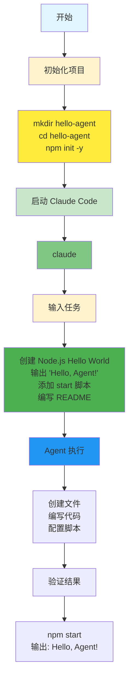
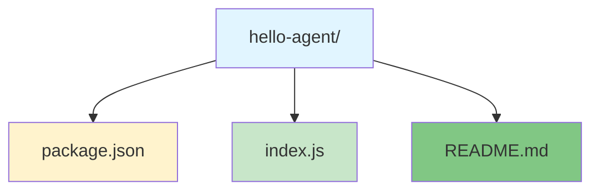
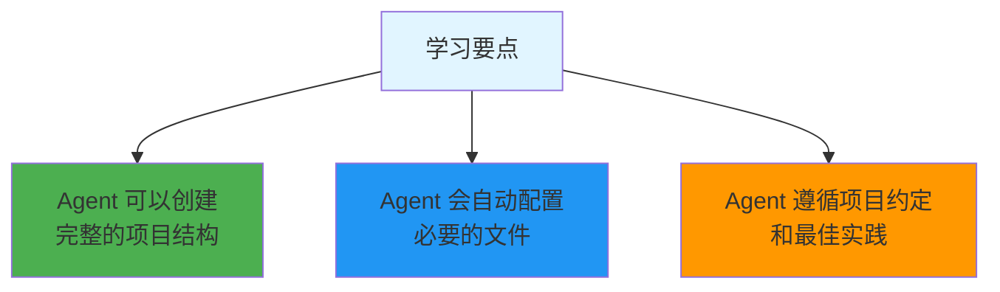
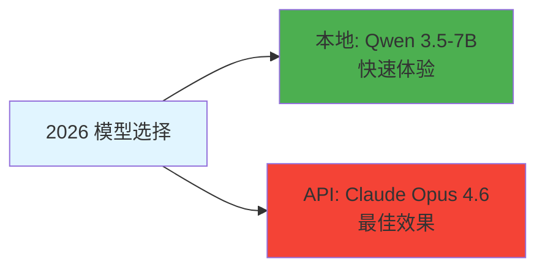

# Hello World Demo

> 📖 **资料来源**: Claude Code 官方文档
>
> 📅 **更新日期**: 2026年3月

## 简介

这是最简单的 Agent 使用示例，帮助你快速上手。

## 工作流程



## 任务描述

创建一个简单的 "Hello World" 程序，展示 Agent 的基本能力。

## 步骤

### 1. 初始化项目

```bash
mkdir hello-agent
cd hello-agent
npm init -y
```

### 2. 使用 Claude Code

```bash
claude

# 在 Claude 中输入:
"创建一个简单的 Node.js Hello World 程序:
- 输出 'Hello, Agent!'
- 添加 package.json 的 start 脚本
- 编写 README.md"
```

### 3. 验证结果

```bash
npm start
# 应该输出: Hello, Agent!
```

## 预期结果



## 学习要点



## 2026 提示



## 下一步

尝试 [调试 Demo](subagent/)
