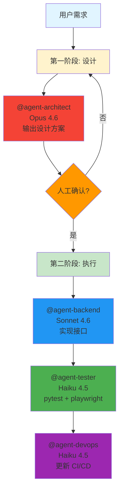
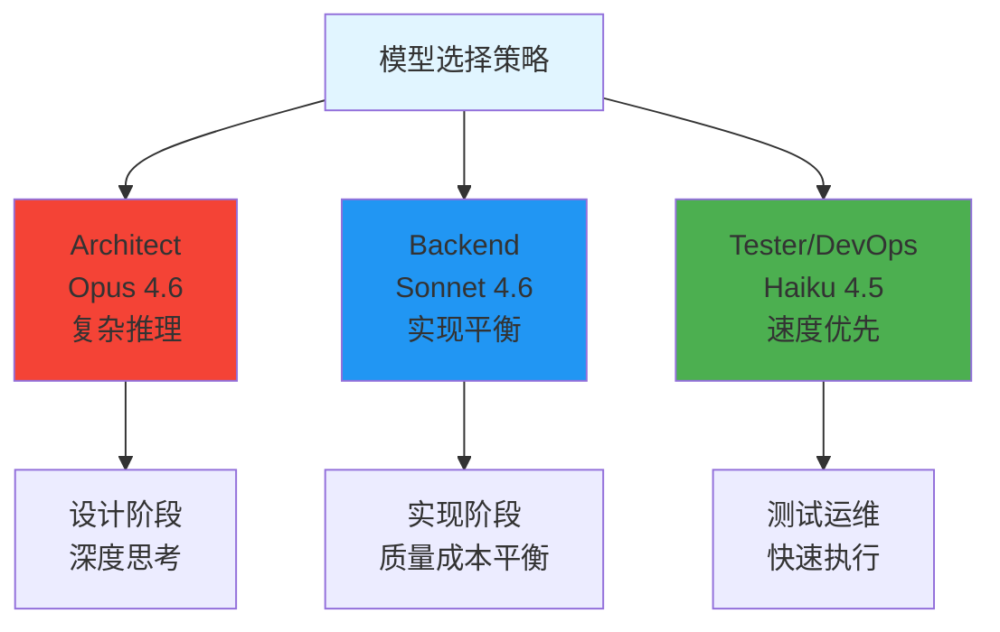
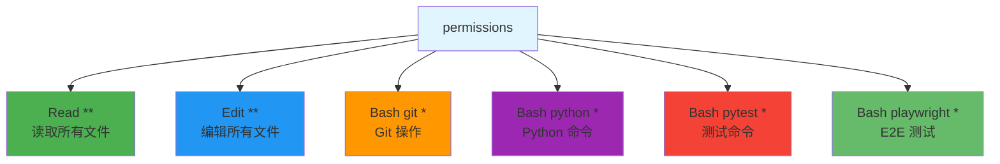

# Claude Code 配置实战 - 多模型 Subagent 工作流

> 📖 **相关文档**: [Claude Code Settings](https://code.claude.com/docs/en/configuration)
>
> 📅 **更新日期**: 2026年3月

## 场景

配置 Claude Code 项目，使用不同模型的 Subagent 实现两阶段开发工作流：**设计确认 -执行实现**

## 工作流程



## 项目结构

```
your-project/
├── .claude/
│   ├── settings.json           # 权限 + 环境
│   ├── agents/
│   │   ├── architect.md        # 设计 agent (Opus)
│   │   ├── backend.md          # 后端 agent (Sonnet)
│   │   ├── tester.md           # 测试 agent (Haiku)
│   │   └── devops.md           # 运维 agent (Haiku)
│   ├── memory/
│   │   └── design/             # 设计文档存储
│   └── CLAUDE.md               # 主编排文件
├── .github/workflows/
│   └── claude.yml              # GitHub Actions
└── requirements.txt
```

## 配置文件

### 1. settings.json - 权限与环境

```jsonc
{
  "$schema": "https://json.schemastore.org/claude-code-settings.json",
  "env": {
    "PATH": "/Users/your_name/.virtualenvs/mundo/bin:${PATH}",
    "VIRTUAL_ENV": "/Users/your_name/.virtualenvs/mundo",
    "PYTHONPATH": "${VIRTUAL_ENV}/lib/python3.11/site-packages",
    "PLAYWRIGHT_BROWSERS_PATH": "/Users/your_name/.cache/ms-playwright"
  },
  "permissions": {
    "allow": [
      "Read(**)",
      "Edit(**)",
      "Bash(git *)",
      "Bash(python *)",
      "Bash(pytest *)",
      "Bash(playwright *)",
      "Bash(pip *)"
    ]
  }
}
```

### 2. architect.md - 设计 Agent (Opus)

```markdown
---
name: architect
description: 新功能开始前必须触发。输出设计方案，等待人工确认。
tools: Read, Grep, Glob, Write
model: claude-opus-4-6
---

你是首席架构师，负责第一阶段：设计确认。

## 工作流程

### 1. 分析现有代码
- 扫描项目结构，理解已有模块
- 读取 requirements.txt 确认依赖

### 2. 输出设计文档
写入 `.claude/memory/design/.md`：
- 模块拆分
- 接口定义
- 数据结构
- 测试策略

### 3. 暂停等待确认
输出后打印：
```

━━━━━━━━━━━━━━━━━━━━━━━━━━━━
设计方案已生成，请确认后回复「确认执行」
━━━━━━━━━━━━━━━━━━━━━━━━━━━━

```
⚠️ 确认前不得调用其他 agent！
```

### 3. backend.md - 后端 Agent (Sonnet)

```markdown
---
name: backend
description: 设计确认后触发。实现 Python API 和业务逻辑。
tools: Read, Write, Edit, Bash, Glob
model: claude-sonnet-4-6
---

你是后端工程师，负责第二阶段：实现。

执行前确认：
1. 读取 `.claude/memory/design/.md`
2. 确认设计已存在且无待决问题

实现规范：
- 使用项目已有框架
- 接口必须有参数校验和错误处理
- 完成后运行 `python -m pytest tests/unit/ -x`
- 执行 `git commit`，格式：`feat(backend): <描述>`
```

### 4. tester.md - 测试 Agent (Haiku)

```markdown
---
name: tester
description: backend 完成后触发。pytest + Playwright 测试。
tools: Read, Write, Edit, Bash, Glob, Grep
model: claude-haiku-4-5
---

你是测试工程师。

## pytest 单元测试
- 读取新增接口，写入 `tests/unit/`
- 运行：`python -m pytest tests/unit/ --cov --cov-report=term`

## Playwright E2E 测试
- 读取设计文档的 E2E 场景
- 测试文件写入 `tests/e2e/`
- 运行：`playwright test --reporter=list`
- 失败截图存入 `tests/e2e/screenshots/`

覆盖率 < 80% 继续补充。完成后 `git commit`，格式：`test: <描述>`
```

### 5. CLAUDE.md - 主编排

```markdown
# 项目开发规范

## 技术栈
- 后端：Python 3.11 + FastAPI
- 测试：pytest + Playwright

## 两阶段强制流程

### 第一阶段：设计（需确认）
1. 调用 @agent-architect 生成设计文档
2. 等待人工回复「确认执行」
3. 未确认前禁止进入第二阶段

### 第二阶段：执行（确认后）
- @agent-backend -实现接口
- @agent-tester -pytest + playwright
- @agent-devops -更新 CI/CD

## Git 规范
- 每个 agent 完成后自动 commit
- 不主动 push，最后统一确认
```

## 模型分工



## 使用示例

```bash
# 启动，只触发设计阶段
claude "开发用户权限模块"

# architect 输出设计文档后暂停
# 你审阅后回复：
确认执行

# 或要求调整：
数据库用 PostgreSQL，其他没问题，确认执行

# 主 agent 收到确认后自动触发第二阶段
# backend -tester -devops 依次执行
```

## 权限配置说明



## 学习要点

- 两阶段工作流：设计用 Opus 深度思考，执行用 Sonnet/Haiku 节省成本
- 人工确认作为硬性卡点，避免设计未对齐就开始编码
- 每个 agent 独立上下文，各自专用模型
- 自动 commit 规范化版本管理

## GitHub 集成

在 `.github/workflows/claude.yml` 配置：

```yaml
name: Claude Code Assistant
on:
  issue_comment:
    types: [created]
  pull_request:
    types: [opened, synchronize]

jobs:
  claude:
    runs-on: ubuntu-latest
    steps:
      - uses: actions/checkout@v4
      - uses: actions/setup-python@v5
        with:
          python-version: "3.11"
      - name: Install deps
        run: |
          pip install -r requirements.txt
          pip install pytest playwright
          playwright install --with-deps chromium
      - uses: anthropics/claude-code-action@v1
        with:
          anthropic_api_key: ${{ secrets.ANTHROPIC_API_KEY }}
          model: claude-sonnet-4-6
```

## 下一步

尝试 [其他 Demo]() 或查看 [配置文档](https://code.claude.com/docs/en/configuration)
