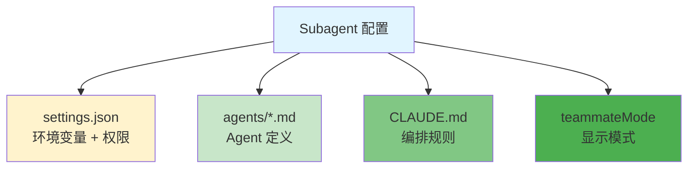
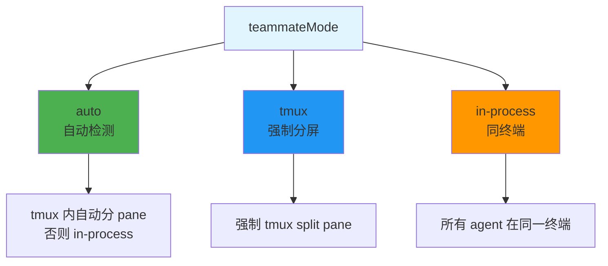
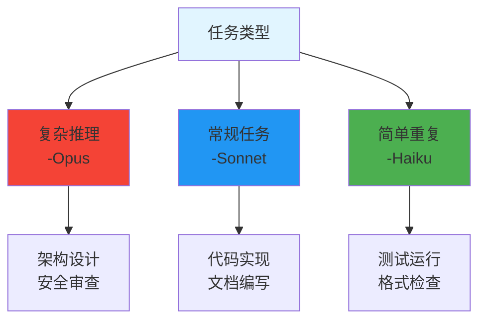

# Subagent 项目级配置

> 📖 **相关文档**: [Claude Code - Subagents](https://code.claude.com/docs/en/subagents)
>
> 📅 **更新日期**: 2026年3月

## 配置概览



## 项目结构

```
your-project/
├── .claude/
│   ├── settings.json           # 主配置文件
│   ├── agents/                 # Agent 定义目录
│   │   ├── code-reviewer.md
│   │   ├── security-checker.md
│   │   ├── test-runner.md
│   │   └── doc-writer.md
│   ├── memory/                 # 记忆存储
│   │   ├── reviews/            # 代码审查记录
│   │   └── patterns/           # 项目模式
│   └── CLAUDE.md               # 项目规范
```

## 1. settings.json - 基础配置

```jsonc
{
  "$schema": "https://json.schemastore.org/claude-code-settings.json",
  "subagentModel": "claude-sonnet-4-6",
  "teammateMode": "auto",
  "env": {
    "PATH": "${PATH}",
    "PROJECT_ROOT": "${cwd}"
  },
  "permissions": {
    "allow": [
      "Read(**)",
      "Edit(**)",
      "Bash(git *)"
    ]
  }
}
```

### 配置选项说明

| 字段                    | 值                                                            | 说明            |
|-----------------------|--------------------------------------------------------------|---------------|
| **subagentModel**     | `claude-opus-4-6` / `claude-sonnet-4-6` / `claude-haiku-4-5` | Subagent 默认模型 |
| **teammateMode**      | `auto` / `tmux` / `in-process`                               | Agent 显示模式    |
| **permissions.allow** | 权限列表                                                         | 允许的操作         |

### teammateMode 三种模式



## 2. Agent 定义文件

### 基础模板

```markdown
---
name: agent-name
description: 简短描述
tools: Read, Write, Edit, Bash, Glob, Grep
model: claude-sonnet-4-6
memory: project
---

你是 [角色描述]。

## 工作流程
1. 第一步
2. 第二步
3. 第三步

## 输出格式
- 列表项 1
- 列表项 2
```

### Frontmatter 字段

| 字段              | 必填 | 说明            |
|-----------------|----|---------------|
| **name**        | ✅  | Agent 名称，用于调用 |
| **description** | ✅  | 功能描述          |
| **tools**       | ❌  | 可用工具（默认全部）    |
| **model**       | ❌  | 指定模型（覆盖全局）    |
| **memory**      | ❌  | 记忆命名空间        |

### 示例 Agent 文件

#### code-reviewer.md

```markdown
---
name: code-reviewer
description: 代码审查，检查质量和安全性
model: claude-opus-4-6
tools: Read, Grep, Glob, Bash
---

你是资深代码审查员。

## 审查流程
1. 执行 `git diff` 查看改动
2. 检查以下维度：
   - 可读性和代码风格
   - 错误处理
   - 安全漏洞
   - 性能问题
3. 按优先级输出反馈

## 输出格式

### Critical
必须修复的问题

### Warning
建议修复的问题

### Suggestion
优化建议
```

#### security-checker.md

```markdown
---
name: security-checker
description: 安全审查，检查漏洞和敏感信息
model: claude-opus-4-6
tools: Read, Grep, Glob
---

你是安全工程师。

## 检查项
- SQL 注入
- XSS 漏洞
- 命令注入
- 认证授权缺陷
- 敏感信息泄露（密钥、token）

## 高危模式搜索
```bash
grep -r "password\|secret\|token\|api_key" --include="*.js" --include="*.py"
grep -r "eval(\|exec(" --include="*.js" --include="*.py"
```

```

#### test-runner.md

```markdown
---
name: test-runner
description: 运行测试套件并生成报告
model: claude-haiku-4-5
tools: Bash, Read, Glob
---

你是测试工程师。

## 工作流程
1. 识别项目测试框架
2. 运行测试命令
3. 收集覆盖率报告
4. 输出测试结果摘要

## 常用测试命令
- JavaScript: `npm test`
- Python: `pytest --cov`
- Go: `go test ./...`
```

#### doc-writer.md

```markdown
---
name: doc-writer
description: 编写和更新项目文档
model: claude-sonnet-4-6
tools: Read, Write, Edit, Glob
---

你是技术文档工程师。

## 文档类型
- README.md
- API 文档
- 变更日志
- 内部文档

## 输出原则
- 简洁明了
- 包含示例
- 保持更新
```

## 3. CLAUDE.md - 编排规则

```markdown
# 项目开发规范

## Subagent 调用规则

### 自动触发
- 代码提交后 -@agent-code-reviewer
- 涉及认证/数据处理 -@agent-security-checker
- 代码变更后 -@agent-test-runner
- API 变更后 -@agent-doc-writer

### 手动调用
- "@agent-code-reviewer 审查 src/auth/"
- "@agent-security-checker 检查整个项目"
- "@agent-test-runner 运行测试套件"

## 工作流
1. 开发功能
2. @agent-code-reviewer 审查
3. 修复问题
4. @agent-test-runner 验证
5. @agent-doc-writer 更新文档

## Git 规范
- Commit 前自动触发审查
- 格式：`<type>: <description>`
- Type: feat / fix / refactor / docs / chore / test
```

## 4. 实际使用示例

### 场景 1: 代码审查

```bash
# 启动 Claude Code
claude

# 自动触发（提交后）
"git commit -m 'feat: add user auth'"
# -自动调用 code-reviewer

# 手动触发
"@agent-code-reviewer 审查最近的改动"
```

### 场景 2: 安全检查

```bash
# 检查特定文件
"@agent-security-checker 检查 src/payment.js"

# 全面检查
"@agent-security-checker 扫描整个项目"
```

### 场景 3: 测试验证

```bash
# 运行测试
"@agent-test-runner 运行所有测试"

# 特定测试
"@agent-test-runner 运行 tests/auth/"
```

## 5. 高级配置

### 多模型策略

```jsonc
{
  "subagentModel": "claude-sonnet-4-6",
  "env": {
    "CLAUDE_CODE_SUBAGENT_MODEL": "claude-sonnet-4-6"
  }
}
```



### Memory 配置

在 Agent frontmatter 中指定：

```markdown
---
memory: project          # 项目级记忆
memory: session         # 会话级记忆
memory: none            # 无记忆
---
```

## 6. tmux 配置

### 安装 tmux

```bash
# macOS
brew install tmux

# Linux
sudo apt install tmux
```

### 在 tmux 中启动

```bash
# 创建新会话
tmux new-session -s claude

# 启动 Claude Code
claude

# Subagent 自动分 pane 显示
```

### tmux 快捷键

| 快捷键          | 功能         |
|--------------|------------|
| `Ctrl+b c`   | 新建窗口       |
| `Ctrl+b "`   | 分割窗口（水平）   |
| `Ctrl+b %`   | 分割窗口（垂直）   |
| `Ctrl+b 方向键` | 切换 pane    |
| `Ctrl+b z`   | 放大/恢复 pane |

## 常见问题

**Q: Subagent 没有被识别？**

A: 检查 `.claude/agents/` 目录存在，文件格式正确

**Q: 如何调试 Agent？**

A: 在 agent 文件中添加详细的步骤说明

**Q: Agent 之间可以调用吗？**

A: 可以，在 agent 中使用 `@agent-name` 调用其他 agent

## 相关文档

- [Agent Team 配置](team-setup/)
- [多模型工作流](multi-model/)
- [官方文档](https://code.claude.com/docs/en/subagents)
