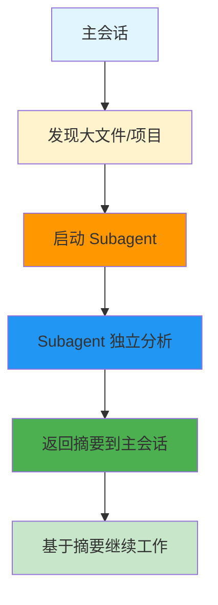
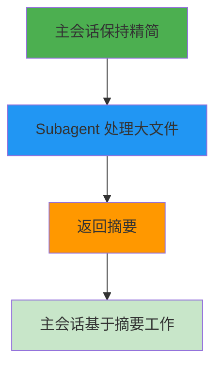
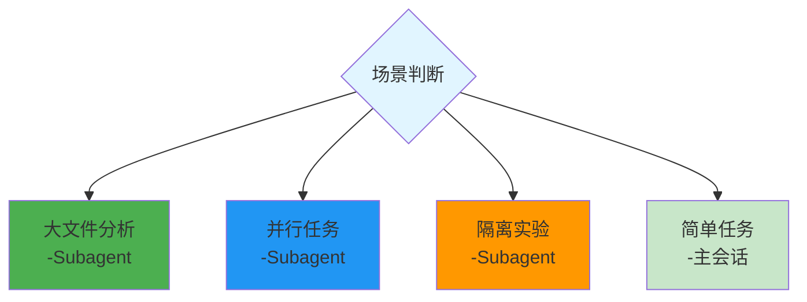

# Subagent Demo - 隔离大文件分析

> 📖 **相关文档**: [Subagents](https://code.claude.com/docs/en/subagents)
>
> 📅 **更新日期**: 2026年3月

## 场景

分析大型项目时，不需要把整个项目内容加载到主上下文中，使用 Subagent 隔离分析。

## 工作流程



## 步骤

### 1. 准备测试项目

```bash
# 创建一个有多个文件的项目
mkdir subagent-demo
cd subagent-demo

# 创建多个源文件
echo 'export const foo = () => "foo"' > src/foo.js
echo 'export const bar = () => "bar"' > src/bar.js
echo 'export const baz = () => "baz"' > src/baz.js
```

### 2. 使用 Subagent 分析

```bash
claude

# 在 Claude 中输入:
"用 subagent 分析 src/ 目录:
1. 独立分析每个模块
2. 总结架构和依赖关系
3. 报告发现的问题
4. 只返回摘要到主会话"
```

### 3. 主会话继续工作

```bash
# Subagent 返回摘要后，主会话继续:
"根据分析结果，帮我重构代码结构"
```

## 预期结果



## 学习要点

- Subagent 有独立的上下文，不会污染主会话
- 主会话只接收摘要，节省 token
- 适合分析大文件、并行任务、隔离实验

## 何时使用 Subagent



## 下一步

尝试 [Agent Team Demo](03-agent-team-demo/)
