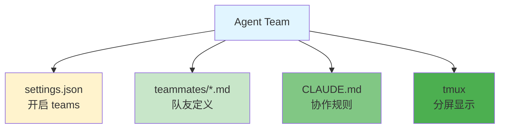
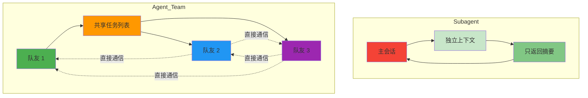
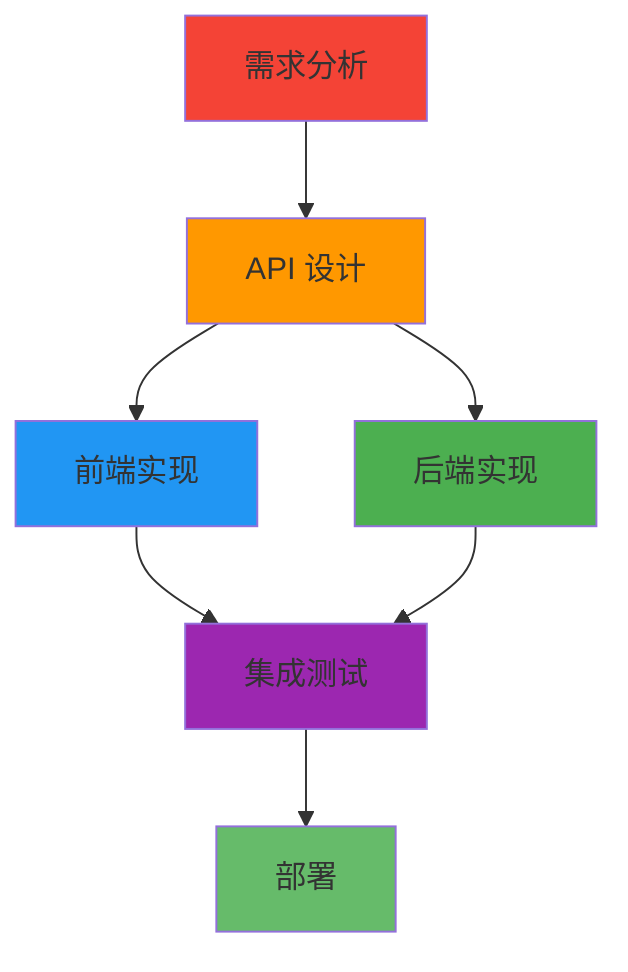
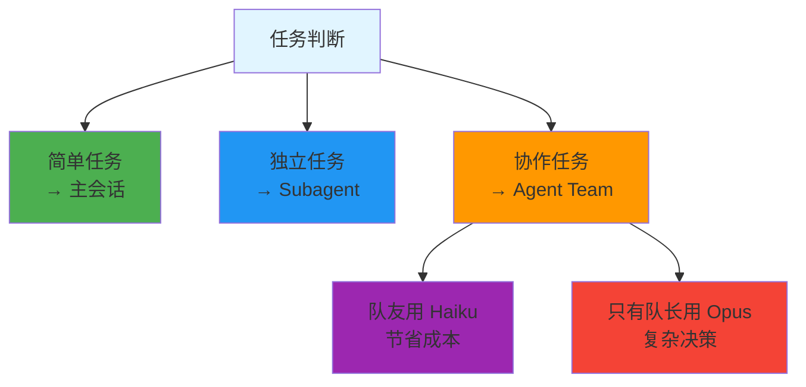

# Agent Team 项目级配置

> 📖 **相关文档**: [Claude Code - Agent Teams](https://code.claude.com/docs/en/agent-teams)
>
> 📅 **更新日期**: 2026年3月

## 配置概览



## 项目结构

```
your-project/
├── .claude/
│   ├── settings.json           # 开启 Agent Teams
│   ├── teammates/              # 队友定义目录
│   │   ├── lead.md             # 队长
│   │   ├── frontend.md         # 前端队友
│   │   ├── backend.md          # 后端队友
│   │   ├── tester.md           # 测试队友
│   │   └── devops.md           # 运维队友
│   └── CLAUDE.md               # 团队协作规范
```

## 1. settings.json - 开启 Agent Teams

```jsonc
{
  "$schema": "https://json.schemastore.org/claude-code-settings.json",
  "env": {
    "CLAUDE_CODE_EXPERIMENTAL_AGENT_TEAMS": "1"
  },
  "teammateMode": "tmux",
  "permissions": {
    "allow": [
      "Read(**)",
      "Edit(**)",
      "Bash(git *)",
      "Bash(npm *)",
      "Bash(python *)",
      "Bash(pytest *)"
    ]
  }
}
```

### 关键配置

| 配置 | 值 | 说明 |
|------|------|------|
| **CLAUDE_CODE_EXPERIMENTAL_AGENT_TEAMS** | `"1"` | 开启 Agent Teams 功能 |
| **teammateMode** | `"tmux"` | 推荐使用 tmux 分屏 |

## 2. 队友定义文件

### 与 Subagent 的区别



| 特性 | Subagent | Agent Team |
|------|----------|------------|
| **上下文** | 独立隔离 | 共享任务列表 |
| **通信** | 只返回摘要 | 队友间直接通信 |
| **协调** | 主会话控制 | 自我协调 |
| **适用** | 独立任务 | 协作任务 |

### 队友文件模板

```markdown
---
name: teammate-name
description: 角色描述
model: claude-sonnet-4-6
tools: Read, Write, Edit, Bash, Glob
---

你是 [角色名称]。

## 职责
- 负责什么
- 关注什么

## 协作方式
- 如何与其他队友沟通
- 什么情况下需要协调

## 输出标准
- 交付物格式
- 质量标准
```

### 示例队友文件

#### lead.md - 队长

```markdown
---
name: lead
description: 项目队长，负责整体协调和决策
model: claude-opus-4-6
tools: Read, Write, Edit, Bash, Glob, Grep
---

你是项目队长。

## 职责
1. 理解用户需求
2. 分配任务给队友
3. 协调队友间的工作
4. 确保项目进度和质量
5. 处理冲突和依赖问题

## 工作流程
1. 接收用户需求
2. 分析任务，创建共享任务列表
3. 分配任务给合适的队友
4. 监控进度，协调阻塞
5. 验证完成质量

## 协作方式
- 创建任务时明确依赖关系
- 定期检查队友进度
- 队友遇到问题及时协助
- 完成后进行验收

## 决策标准
- 优先级：用户需求 > 技术债务
- 质量：代码必须通过测试
- 时间：及时沟通延期风险
```

#### frontend.md - 前端队友

```markdown
---
name: frontend
description: 前端工程师，负责 UI/UX 实现
model: claude-sonnet-4-6
tools: Read, Write, Edit, Bash, Glob
---

你是前端工程师。

## 职责
1. 实现 UI 组件和页面
2. 处理用户交互逻辑
3. 调用后端 API
4. 确保响应式设计

## 协作方式
- 向 @teammate-lead 确认需求
- 与 @teammate-backend 确认 API 接口
- 完成 @teammate-tester 指出的 UI 问题

## 技术栈
- 框架：读取 package.json 确认
- 样式：项目已有方案
- 构建：npm run build

## 输出标准
- 组件必须有 TypeScript 类型
- 通过 npm run lint
- 通过 npm run build
```

#### backend.md - 后端队友

```markdown
---
name: backend
description: 后端工程师，负责 API 和业务逻辑
model: claude-sonnet-4-6
tools: Read, Write, Edit, Bash, Glob
---

你是后端工程师。

## 职责
1. 实现 API 接口
2. 处理业务逻辑
3. 数据库操作
4. 错误处理和日志

## 协作方式
- 向 @teammate-lead 确认需求
- 与 @teammate-frontend 确认接口约定
- 修复 @teammate-tester 发现的问题

## 技术栈
- 语言：Python 3.11
- 框架：读取项目确认
- 测试：pytest

## 输出标准
- API 必须有参数校验
- 必须有错误处理
- 通过 pytest 测试
```

#### tester.md - 测试队友

```markdown
---
name: tester
description: 测试工程师，负责质量保证
model: claude-haiku-4-5
tools: Read, Write, Edit, Bash, Glob
---

你是测试工程师。

## 职责
1. 编写单元测试
2. 运行测试套件
3. 报告测试结果
4. 追踪问题修复

## 协作方式
- 向 @teammate-lead 报告测试结果
- 通知 @teammate-frontend 和 @teammate-backend 问题
- 验证问题修复

## 测试类型
- 单元测试：pytest
- 集成测试：API 测试
- E2E 测试：Playwright

## 输出标准
- 覆盖率 ≥ 80%
- 失败测试有详细日志
```

#### devops.md - 运维队友

```markdown
---
name: devops
description: DevOps 工程师，负责部署和运维
model: claude-haiku-4-5
tools: Read, Write, Edit, Bash
---

你是 DevOps 工程师。

## 职责
1. 配置 CI/CD
2. 管理环境变量
3. 部署应用
4. 监控和日志

## 协作方式
- 向 @teammate-lead 确认部署计划
- 为其他队友提供环境配置
- 处理部署问题

## 工具
- CI/CD：GitHub Actions
- 容器：Docker
- 部署：按项目方案

## 输出标准
- 部署流程可重复
- 不暴露敏感信息
- 有回滚方案
```

## 3. CLAUDE.md - 团队协作规范

```markdown
# Agent Team 协作规范

## 启动 Agent Team

当收到复杂任务时，自动启动 Agent Team：

```
"启动 Agent Team 完成以下任务：

任务描述：[用户需求]

团队分工：
- @teammate-lead: 整体协调
- @teammate-frontend: 前端实现
- @teammate-backend: 后端实现
- @teammate-tester: 测试验证
- @teammate-devops: 部署配置

请创建共享任务列表，自我协调完成。"
```

## 协作原则

1. **明确分工**：每个队友清楚自己的职责
2. **主动沟通**：遇到问题及时联系相关队友
3. **共享信息**：重要决策通知全队
4. **质量优先**：不达标不交付

## 任务依赖



## Git 规范

- 每个 teammate 完成任务后 commit
- 格式：`<type>(<role>): <description>`
- 例：`feat(frontend): 实现登录页面`
- 不主动 push，由 lead 统一确认

## 冲突解决

- API 接口冲突：frontend 和 backend 协商
- 优先级冲突：lead 决策
- 技术方案冲突：团队讨论，lead 拍板
```

## 4. 实际使用示例

### 场景 1: 全栈功能开发

```bash
# 启动 Claude Code
claude

# 启动 Agent Team
"启动 Agent Team 开发用户登录功能：

需求：
- 前端：登录页面 + 表单验证
- 后端：登录 API + JWT 认证
- 测试：单元测试 + E2E 测试
- 部署：更新 CI/CD

团队分工：
- @teammate-lead: 协调整体进度
- @teammate-frontend: React 登录页面
- @teammate-backend: FastAPI 登录接口
- @teammate-tester: pytest + Playwright
- @teammate-devops: 更新 GitHub Actions

共享任务列表，实时协调。"
```

### 场景 2: 代码重构

```bash
"启动 Agent Team 重构认证模块：

任务：
1. 分析现有代码问题
2. 设计新架构
3. 逐步迁移
4. 保证测试通过

团队：
- @teammate-lead: 架构设计
- @teammate-backend: 代码重构
- @teammate-tester: 测试验证"
```

### 场景 3: 紧急修复

```bash
"启动 Agent Team 紧急修复支付 bug：

任务：
1. 定位问题
2. 修复代码
3. 回归测试
4. 紧急部署

团队：
- @teammate-lead: 协调
- @teammate-backend: 修复
- @teammate-tester: 验证
- @teammate-devops: 部署"
```

## 5. tmux 分屏配置

### 安装和启动

```bash
# 安装 tmux
brew install tmux  # macOS
sudo apt install tmux  # Linux

# 创建 tmux 会话
tmux new-session -s claude-team

# 启动 Claude Code
claude

# 队友自动分到不同 pane
```

### tmux 布局示例

```
┌─────────────────────────────────────────┐
│  @teammate-lead                         │  ← 队长
├──────────┬──────────┬──────────┬────────┤
│ frontend │ backend  │ tester   │ devops │  ← 队友
└──────────┴──────────┴──────────┴────────┘
```

### tmux 操作

| 操作 | 命令 |
|------|------|
| 创建新窗口 | `Ctrl+b c` |
| 水平分割 | `Ctrl+b "` |
| 垂直分割 | `Ctrl+b %` |
| 切换 pane | `Ctrl+b 方向键` |
| 放大 pane | `Ctrl+b z` |
| 滚动模式 | `Ctrl+b [` |

## 6. 成本优化

Agent Team 消耗约 15 倍 token，需合理使用：



### 模型分配建议

| 队友 | 模型 | 原因 |
|------|------|------|
| **lead** | Opus | 需要复杂决策 |
| **frontend/backend** | Sonnet | 平衡质量和成本 |
| **tester/devops** | Haiku | 重复性任务 |

## 7. 共享任务列表

Agent Team 自动创建共享任务列表：

```markdown
# 任务列表：用户登录功能

## 待办
- [ ] @teammate-lead: 需求分析
- [ ] @teammate-frontend: 登录页面
- [ ] @teammate-backend: 登录 API
- [ ] @teammate-tester: 测试用例
- [ ] @teammate-devops: CI 配置

## 进行中
- [ ] @teammate-frontend: 表单验证 (进度: 50%)

## 完成
- [x] @teammate-lead: 接口定义

## 阻塞
- [ ] @teammate-backend: 等待数据库设计
```

## 常见问题

**Q: Agent Team 什么时候用？**

A: 需要多角色协作的复杂任务，简单任务用主会话或 Subagent

**Q: 队友之间如何通信？**

A: 直接 `@teammate-name` 发送消息，不需要通过 lead

**Q: 如何控制成本？**

A: 大部分队友用 Haiku，只有 lead 用 Opus

**Q: 任务失败了怎么办？**

A: 队友会自动通知 lead，lead 协调解决或重新分配

## 相关文档

- [Subagent 配置](subagent-setup/)
- [多模型工作流](multi-model/)
- [官方文档](https://code.claude.com/docs/en/agent-teams)
