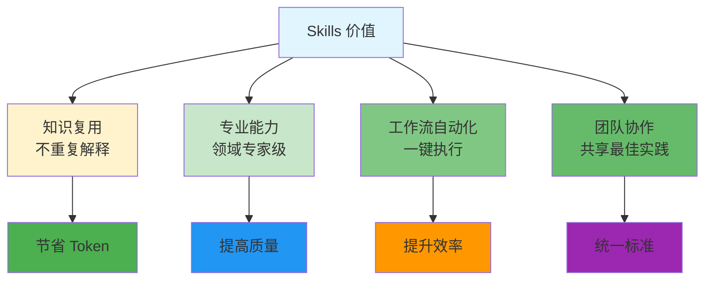

# Skills - 可复用能力

> 📖 **详细文档**: [Claude Code - Skills](https://code.claude.com/docs/en/skills)

## 什么是 Skills？

**Skills** - 封装专业知识和工作流程的可复用单元，让 Agent 具备特定领域能力。

## 为什么使用 Skills？



## Skill 类型

```mermaid
flowchart TD
    A[Skill 分类] --> B[内置 Slash 命令<br/>开箱即用]
    A --> C[用户自定义<br/>项目特定]
    A --> D[社区贡献<br/>第三方发布]

    B --> E[/commit /review /debug<br/>/ship /qa /release]
    C --> F[团队约定<br/>业务逻辑]
    D --> G[awesome-skills<br/>工具集成]

    style A fill:#e1f5ff
    style B fill:#4caf50
    style C fill:#2196f3
    style D fill:#ff9800
```

## 本目录结构

```
skills/
├── README.md              # 本文件
├── how-to-install.md      # 安装教程
├── recommended.md         # 推荐技能列表
├── awesome-skills.md      # 社区精选技能
└── create-your-own.md     # 创建指南
```

## 快速开始

```bash
# 1. 创建 Skills 目录
mkdir -p .claude/skills

# 2. 创建 Skill 文件
cat > .claude/skills/my-skill.md << 'EOF'
---
name: my-skill
description: 我的第一个技能
---

使用说明...
EOF

# 3. 验证
claude skill list
```

## 相关概念

- [CLAUDE.md](../CLAUDE.md) - 项目级配置
- [MCP](../concepts/mcp.md) - 外部工具集成
- [Agent](../concepts/agent.md) - Agent 使用 Skills

## 资源链接

- **Claude Code Skills**: https://code.claude.com/docs/en/skills
- **Skills 示例仓库**: https://github.com/anthropics/claude-code-skills
- **awesome-skills**: [查看社区推荐](./awesome-skills.md)
