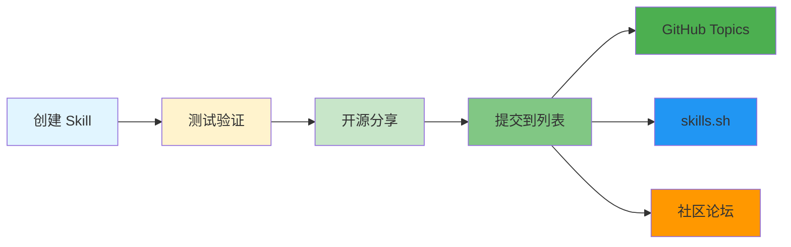

# Awesome Skills - 社区精选

## 官方资源

| 资源                     | 链接                                               | 说明   |
|------------------------|--------------------------------------------------|------|
| **Claude Code Skills** | https://code.claude.com/docs/en/skills           | 官方文档 |
| **示例仓库**               | https://github.com/anthropics/claude-code-skills | 官方示例 |
| **创建指南**               | https://code.claude.com/docs/en/skills/creating  | 创建教程 |

## 社区资源

### Skills 发现平台

| 平台                 | 链接                                      | 特点          |
|--------------------|-----------------------------------------|-------------|
| **skills.sh**      | https://skills.sh                       | Skills 导航网站 |
| **Awesome Claude** | https://github.com/topics/claude-skill  | GitHub 话题   |
| **Claude Recipes** | https://github.com/topics/claude-recipe | 社区分享        |

### 推荐仓库

| 仓库                        | 链接                                               | 描述     |
|---------------------------|--------------------------------------------------|--------|
| **claude-code-skills**    | https://github.com/anthropics/claude-code-skills | 官方示例集合 |
| **awesome-claude-skills** | https://github.com/topics/awesome-claude         | 社区精选   |

## 精选 Skills

### 开发工作流

#### Committer

```markdown
---
name: committer
description: 智能提交信息生成
---

分析 git diff，生成符合 Conventional Commits 的提交信息。
```

#### PR Reviewer

```markdown
---
name: pr-reviewer
description: 自动 PR 审查
---

检查 PR 的：
- 代码质量
- 安全问题
- 测试覆盖
- 文档完整性
```

### 代码生成

#### Component Generator

```markdown
---
name: gen-component
description: 生成 React 组件
---

生成包含：
- TypeScript 类型
- 样式文件
- 测试文件
- Storybook 故事
```

#### API Route

```markdown
---
name: gen-api
description: 生成 API 路由
---

生成符合：
- RESTful 规范
- OpenAPI 文档
- 错误处理
- 请求验证
```

### 质量保证

#### Test Generator

```markdown
---
name: gen-test
description: 生成单元测试
---

为函数/组件生成：
- 单元测试
- 边界测试
- 错误测试
```

#### Lint Fixer

```markdown
---
name: lint-fix
description: 自动修复 lint 问题
---

运行：
- eslint --fix
- prettier --write
- stylelint --fix
```

## 贡献你的 Skill



## 技能模板

### 通用模板

```markdown
---
name: your-skill-name
description: 一句话描述功能
---

## 功能说明
详细描述技能做什么。

## 使用方式
说明如何调用此技能。

## 注意事项
列出使用时需要注意的点。
```

## 相关文档

- [安装教程](./how-to-install.md)
- [推荐列表](./recommended.md)
- [创建指南](./create-your-own.md)

## 资源链接

- **官方文档**: https://code.claude.com/docs/en/skills
- **skills.sh**: https://skills.sh
- **GitHub Topics**: https://github.com/topics/claude-skill
