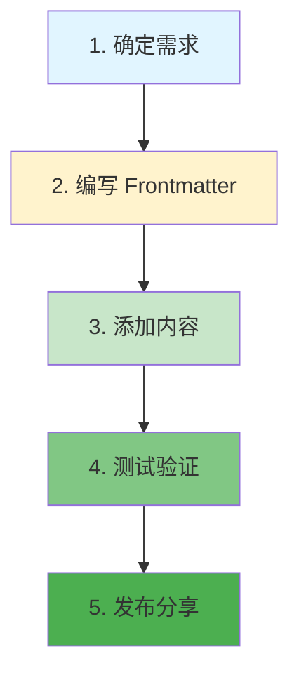
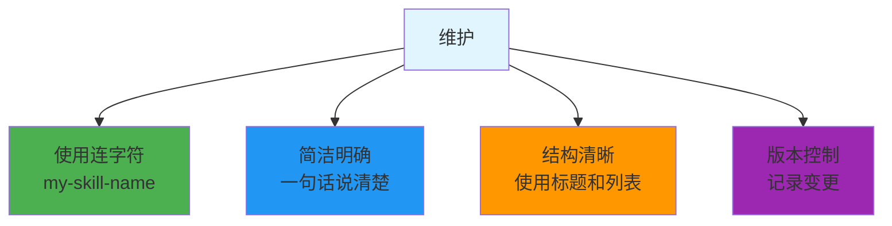

# 创建你的 Skill

## 创建流程



## 步骤 1: 确定 Skill 用途

思考这些问题：

- **解决什么问题？** - 重复性任务、专业知识、工作流自动化
- **谁会使用？** - 个人、团队、社区
- **输入输出？** - 需要什么信息，返回什么结果

## 步骤 2: 编写 Frontmatter

```markdown
---
name: skill-name              # 必填：英文名称，用于调用
description: 简短描述          # 必填：一句话说明功能
---

# 可选字段
author: your-name             # 作者
version: 1.0.0                # 版本
tags: [category, tags]        # 标签
```

## 步骤 3: 添加内容

### 知识型 Skill

用于存储项目特定的知识、架构约定、规范等。

```markdown
---
name: project-architecture
description: 项目架构说明
---

## 系统架构

项目采用分层架构：

前端层: React + TypeScript
     ↓
API 层: RESTful API
     ↓
服务层: 业务逻辑
     ↓
数据层: PostgreSQL

## 关键约定
- API 路径: /api/v1/*
- 错误码: 参考 errors.md
- 认证: JWT Token
```

### 工作流型 Skill

```markdown
---
name: deploy-checklist
description: 部署前检查清单
---

## 部署前检查

- [ ] 测试全部通过
- [ ] CHANGELOG 已更新
- [ ] 版本号已更新
- [ ] 环境变量已配置
- [ ] 数据库迁移已准备
- [ ] 回滚计划已确认

## 执行部署
1. 合并到 main 分支
2. 等待 CI 通过
3. 运行部署命令
4. 验证健康检查
```

### 生成型 Skill

```markdown
---
name: gen-api-route
description: 生成 API 路由模板
---

请生成一个 API 路由文件，包含：

1. 类型定义
2. 请求验证
3. 错误处理
4. 响应格式
5. 单元测试

路由名称: {{name}}
方法: {{method}}
路径: {{path}}
```

## 步骤 4: 测试验证

```bash
# 1. 保存 Skill
mkdir -p .claude/skills
cp my-skill.md .claude/skills/

# 2. 验证格式
claude skill list

# 3. 测试调用
# "请使用 my-skill 帮我..."
```

## 步骤 5: 发布分享

```bash
# 1. 创建仓库
git init
git add my-skill.md
git commit -m "Add my-skill"

# 2. 推送到 GitHub
git remote add origin https://github.com/user/skills.git
git push -u origin main

# 3. 添加 topic
# 在 GitHub 设置 topics: claude-skill, awesome-claude
```

## 最佳实践



## 调试技巧

**Skill 没有被识别？**

- 检查 frontmatter 格式（必须有 `---` 包围）
- 确认文件在正确的目录
- 验证 YAML 语法正确

**Skill 执行不符合预期？**

- 检查描述是否准确
- 添加更多示例
- 使用明确的指令

## 相关文档

- [安装教程](./how-to-install.md)
- [推荐列表](./recommended.md)
- [社区精选](./awesome-skills.md)
