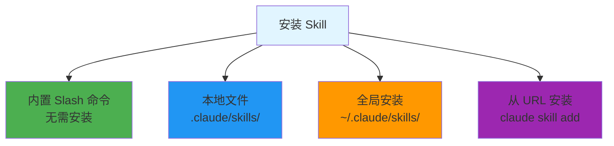
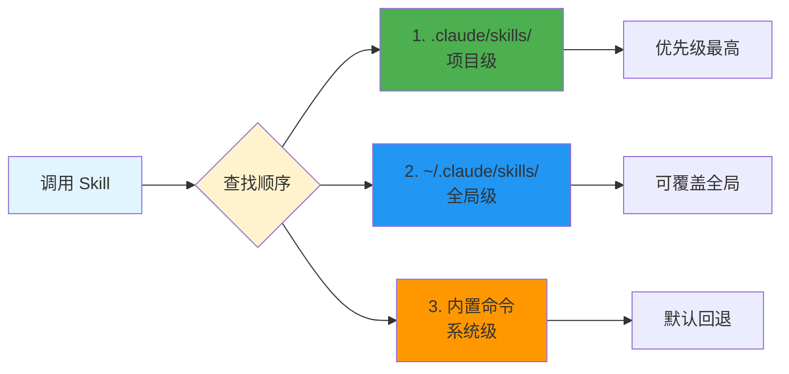

# Skills 安装教程

## 安装方式概览



## 方式 1: 项目级 Skill

**适用场景**: 项目特定逻辑、团队约定

```bash
# 1. 在项目根目录创建 Skills 目录
mkdir -p .claude/skills

# 2. 创建 Skill 文件
cat > .claude/skills/team-convention.md << 'EOF'
---
name: team-convention
description: 团队代码规范检查
---

## 代码规范
- 使用 4 空格缩进
- 函数名使用 camelCase
- 组件名使用 PascalCase
EOF

# 3. 验证安装
ls .claude/skills/
```

## 方式 2: 全局 Skill

**适用场景**: 通用工具、个人工作流

```bash
# 1. 创建全局 Skills 目录
mkdir -p ~/.claude/skills

# 2. 创建 Skill 文件
cat > ~/.claude/skills/summarize.md << 'EOF'
---
name: summarize
description: 生成内容摘要
---

请生成以下内容的摘要：
EOF

# 3. 验证
ls ~/.claude/skills/
```

## 方式 3: 从 URL 安装

**适用场景**: 社区 Skill、GitHub 仓库

```bash
# 安装单个 Skill
claude skill add https://raw.githubusercontent.com/user/repo/main/skill.md

# 安装整个仓库
git clone https://github.com/user/awesome-skills.git ~/.claude/skills/awesome
```

## Skill 文件格式

```markdown
---
name: skill-name          # 必填：技能名称
description: 简短描述      # 必填：功能说明
---

## 技能内容

可以是：
- 工作流程说明
- 专业知识
- 代码模板
- 验证清单
```

## 目录结构优先级



## 常见问题

**Q: Skill 和 MCP 的区别？**

A: Skills 是知识和工作流，MCP 是外部数据访问。

**Q: 如何调试 Skill？**

A: 使用 `claude skill list` 查看，检查 frontmatter 格式。

**Q: 可以嵌套调用 Skill 吗？**

A: 可以，在 Skill 中引用其他 Skill。

## 相关文档

- [Skill 创建指南](./create-your-own.md)
- [推荐 Skills](./recommended.md)
- [社区精选](./awesome-skills.md)
