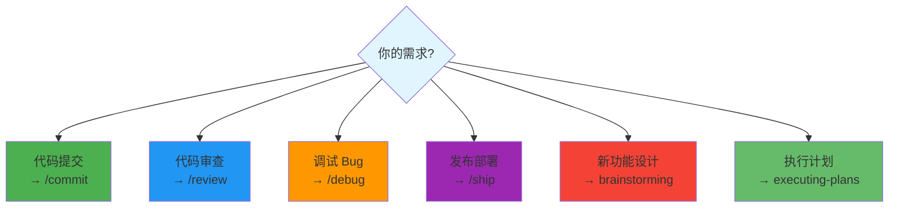

# 推荐技能列表

## 内置 Slash 命令

| 命令 | 功能 | 使用场景 |
|------|------|----------|
| **/commit** | 创建 git commit | 代码提交前 |
| **/review** | PR 代码审查 | 合并前检查 |
| **/debug** | 系统化调试 | 遇到 bug 时 |
| **/ship** | 发布工作流 | 准备部署时 |
| **/qa** | QA 测试 | 需要测试时 |
| **/release** | 版本发布 | 发布新版本 |
| **/simplify** | 代码简化 | 重构代码 |
| **/plan** | 进入计划模式 | 复杂任务规划 |

## 官方 Superpowers

这些是强化 Agent 能力的核心技能：

| 技能 | 功能 | 安装 |
|------|------|------|
| **brainstorming** | 创意设计协作 | 内置 |
| **debugging** | 系统化调试 | 内置 |
| **tdd** | 测试驱动开发 | 内置 |
| **writing-plans** | 编写实施计划 | 内置 |
| **executing-plans** | 执行计划 | 内置 |

## 社区推荐 Skills

### 代码质量

```markdown
---
name: eslint-auto-fix
description: 自动修复 ESLint 错误
---

运行 eslint --fix 自动修复所有可修复的问题。
```

```markdown
---
name: type-check
description: TypeScript 类型检查
---

运行 tsc --noEmit 检查类型错误。
```

### 工作流自动化

```markdown
---
name: pr-template
description: PR 模板生成
---

根据 .github/pull_request_template.md 生成 PR 描述。
```

```markdown
---
name: changelog
description: 自动更新 CHANGELOG
---

根据 git commit 历史更新 CHANGELOG.md。
```

### 项目特定

```markdown
---
name: api-route
description: 创建 API 路由模板
---

创建符合项目规范的 API 路由文件。
```

```markdown
---
name: component
description: 创建组件模板
---

创建符合项目规范的组件文件。
```

## 安装推荐

```bash
# 克隆推荐 Skills 集合
git clone https://github.com/anthropics/claude-code-skells.git ~/.claude/skills/community

# 或手动添加单个 Skill
curl -o ~/.claude/skills/eslint-auto-fix.md \
  https://raw.githubusercontent.com/user/repo/main/eslint-auto-fix.md
```

## 按场景选择



## 相关文档

- [安装教程](./how-to-install.md)
- [社区精选](./awesome-skills.md)
- [创建指南](./create-your-own.md)
